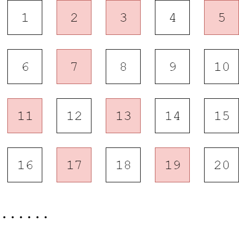

# Chapter-8 NumberTheory
# 第8章 数论

--------

1. [Sieve 筛选算法](Sieve/README.md)
2. [Euclid 欧几里得](Euclid/README.md)
3. [EuclidExtension 欧几里得扩展](EuclidExtension/README.md)
4. [ModularLinearEquation 模线性方程](ModularLinearEquation/README.md)
5. [ChineseRemainerTheorem 中国剩余定理](ChineseRemainerTheorem/README.md)
6. [ModularExponentiation 模幂运算](ModularExponentiation/README.md)
