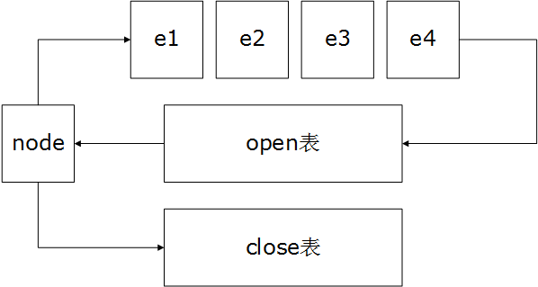

--------
[Upper Folder - 上一级目录](../)

--------
<h1 align="center"> A Star Search </h1>
<h1 align="center"> A*搜索 </h1>
 
 

问题： 
&emsp;&emsp;对于\\(3 \times 3\\)的矩阵
\\begin{bmatrix}
2 & 8 & 1 \\
3 & 7 & x \\
6 & 4 & 5
\\end{bmatrix}
&emsp;&emsp;\\(x\\)点可以与上下左右的相邻点交换位置，除此之外不能随意改变位置，将该矩阵变成
\\[
\begin{bmatrix}
1 & 2 & 3 \\
4 & 5 & 6 \\
7 & 8 & x
\end{bmatrix}
\\]
&emsp;&emsp;求最少变换次数以及变化经过，若将矩阵的初始状态看作起点\\(beg\\)，最终状态看作终点\\(end\\)，即搜索\\(beg\\)到\\(end\\)的最短路径。  
&emsp;&emsp;本问题的原型是“八数码问题”。  

解法：  
&emsp;&emsp;与之前问题不同，本问题将每种矩阵状态看作一个节点，是一种时间上的状态搜索。本文用A*搜索来解决该问题，A*算法是一种启发式搜索，与DFS和BFS这种无差别搜索不同，A*算法设置一个评价函数\\(f(x)\\)来计算节点\\(x\\)的搜索代价（到目标的距离），优先搜索那些离目标最近的点，从而提高搜索效率。  
&emsp;&emsp;A*算法的评价函数\\(f(x) = g(x) + h(x)\\)，其中\\(x\\)是节点，\\(f(x)\\)表示\\(x\\)点到\\(end\\)的评价距离，\\(g(x)\\)表示从\\(beg\\)节点到\\(x\\)节点的实际最短距离，\\(h(x)\\)表示从\\(x\\)点到\\(end\\)节点的估算距离。在A*算法的等待队列中，总是优先选取\\(f(x)\\)最小的点进行搜索。  
&emsp;&emsp;在本问题中矩阵节点\\(x\\)的估算距离为\\(x\\)与\\(end\\)在对应位置\\([i,j]\\)（其中\\(i,j \epsilon [1,3]\\)）上不同数字的数量之和：  
\\[\begin{equation}
h(x) = \sum_{i=1}^3 \sum_{j=1}^3 k_{i,j}
\end{equation} \quad \quad
k_{i,j} =
\begin{cases}
1 & { x_{i,j} = end_{i,j} }, \\\\
0 & { x_{i,j} \neq end_{i,j} }.
\end{cases}
\\]
&emsp;&emsp;对于下面的矩阵，\\(h(a) = 6\\)，\\(h(b) = 7\\)：  
\\[
a
\begin{bmatrix}
1 & 2 & 3 \\\\
4 & 5 & 6 \\\\
7 & 8 & x
\end{bmatrix}
\quad
b
\begin{bmatrix}
1 & 2 & 3 \\\\
4 & x & 5 \\\\
7 & 8 & 6
\end{bmatrix}
\quad
c
\begin{bmatrix}
1 & x & 3 \\\\
5 & 2 & 6 \\\\
4 & 7 & 8
\end{bmatrix}
\\]
&emsp;&emsp;与之前的问题不同，本问题中的节点是一种矩阵状态。之前的解法中我们用染色的方式来标记节点是否被访问过，编码实现时可以用数组下标来标记节点\\(i\\)的颜色。而矩阵状态是无法作为数组下标的，不过我们可以用哈希表来记录矩阵状态\\(x\\)是否被访问过，以及从\\(beg\\)节点到达\\(x\\)的节点距离。矩阵可以通过下面这两种方式分别映射为字符串或数字（string和int都可以作为哈希表键值）：  
\\[
\begin{bmatrix}
1 & 2 & 3 \\\\
4 & x & 5 \\\\
7 & 8 & 6
\end{bmatrix}
\Rightarrow
string('1234x5786')
\quad
\begin{bmatrix}
1 & 2 & 3 \\\\
4 & x & 5 \\\\
7 & 8 & 6
\end{bmatrix}
\Rightarrow
int(123495786)
\\]
&emsp;&emsp;设置open表、close表和g分数表。g分数表是一个哈希表\\(x \Rightarrow g(x)\\)，用来存储每个节点的实际距离\\(g(x)\\)。open表是一个优先队列，与之前搜索算法中的队列功能相同，用于管理等待访问的节点，但是我们需要从open表中总是优先取出可能离\\(end\\)最近的节点，因此其优先级为评价距离\\(f(x)\\)。close表是一个节点\\(x\\)的集合，用于查询所有已经访问过的节点。  
&emsp;&emsp;初始时我们将\\(beg\\)节点插入open表和close表中，令\\(g(beg) = 0\\)。  
&emsp;&emsp;每一次搜索中，从open表中取出评价距离\\(f\\)最小的节点\\(node\\)，若\\(node = end\\)则算法结束；否则将\\(node\\)插入close表中（也可称为染色，染色的、属于close表中的节点都是不能再被访问的），该矩阵中的\\('x'\\)与上下左右四个数字交换位置，得到新的四个节点\\(e_1\\)、\\(e_2\\)、\\(e_3\\)、\\(e_4\\)，若他们不在close表中，将其插入open表和close表中。  
&emsp;&emsp;在维护open中节点的优先级时需要使用\\(g(x)\\)，因为\\(f(x) = g(x) + h(x)\\)。  

&emsp;&emsp;当搜索到open表中没有节点可以访问时，则说明\\(beg\\)节点永远无法到达\\(end\\)节点，两个矩阵状态无法转换。更复杂一些的情况，在\\(beg\\)可以到达end的基础上，需要求出从\\(beg\\)到\\(end\\)的路径，这时我们可以把close表改为哈希表\\(x \Rightarrow from(x)\\)，用来存储节节点\\(x\\)及其父节点\\(from\\)，最后从\\(end\\)节点反向，通过查找close表就可以找到一条反向的路径。  
&emsp;&emsp;本问题中A*搜索的时间复杂度为\\(O(9^9)\\)。  

八数码问题：  
* [http://www.d.umn.edu/~jrichar4/8puz.html](http://www.d.umn.edu/~jrichar4/8puz.html)
* [https://www.cs.princeton.edu/courses/archive/fall12/cos226/assignments/8puzzle.html](https://www.cs.princeton.edu/courses/archive/fall12/cos226/assignments/8puzzle.html)

--------
