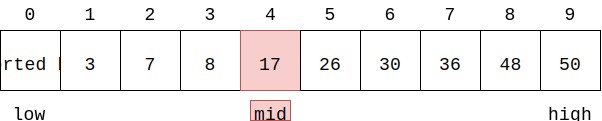
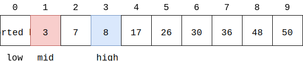
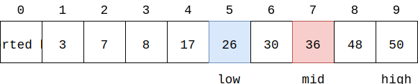

# Binary Search - 二分查找法（折半查找法）

--------

#### 问题

在长度为$$ n $$的有序序列$$ s $$中查找元素$$ x $$的位置。

#### 解法

有序序列$$ s $$可以是升序或降序的，即从小到大或从大到小，本问题假设$$ s $$是升序的。

在长度为$$ n $$的升序序列$$ s $$中想要找出某个元素$$ x $$是否存在，在序列$$ s $$中初始化$$ low = 0 $$，$$ high = n-1 $$。

当$$ low \le high $$时，对于范围$$ [low,high] $$，设$$ mid = \lfloor \frac{high+low}{2}\rfloor $$（向下取整），若$$ x = s[mid] $$则$$ mid $$即为所求，算法结束；若$$ x \lt s[mid] $$，则$$ x $$的位置在子范围$$ s[0,mid-1] $$中，令$$ high = mid-1 $$；若$$ x \gt s[mid] $$，则$$ x $$的位置在子范围$$ s[mid+1,n-1] $$中，令$$ low = mid+1 $$。对于缩小的子范围$$ [low,high] $$，重复上述搜索操作，直到找到$$ x = s[mid] $$。若$$ low \gt high $$时仍然找不到$$ x = s[mid] $$，则序列$$ s $$中不存在$$ x $$。

例如下图中，若$$ x = 17 = s[mid] $$，可以直接找到$$ x = s[4] $$：

若$$ x = 5 \lt s[mid] = 17 $$，则令$$ high = 3 $$之后继续搜索：

若$$ x = 30 \gt s[mid] = 17 $$，则令$$ low = 5 $$之后继续搜索：

对于长度为$$ n $$的序列$$ s $$，每次计算$$ mid $$的时间看作$$ O(1) $$。在最好情况下1次查找就可以找到；在最坏情况下需要$$ log_2⁡n $$次才能找到$$ x $$。该算法的时间复杂度为$$ O(log_2⁡n) $$。

--------

#### 源码

[import, lang:"c_cpp"](../../../src/Search/BinarySearch.hpp)

#### 测试

[import, lang:"c_cpp"](../../../src/Search/BinarySearch.cpp)
