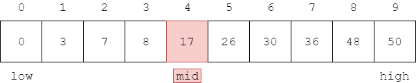
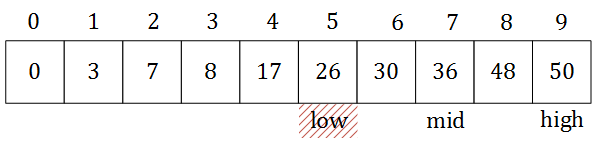

# Binary Search - 二分查找法（折半查找法）

--------

#### 问题

在长度为$$ n $$的有序序列$$ s $$中查找元素$$ x $$的位置。

#### 解法

有序序列$$ s $$可以是升序（从小到大）或降序（从大到小）的，本问题中的$$ s $$是升序。

初始化$$ low = 0 $$，$$ high = n-1 $$。$$ low $$和$$ high $$有以下情况：

$$ (1) $$ $$ low \leq high $$，令$$ mid = \lfloor \frac{high+low}{2}\rfloor $$（向下取整）。若$$ x = s[mid] $$则$$ mid $$即为所求，算法结束；若$$ x \lt s[mid] $$，则$$ x $$的位置在子范围$$ s[0,mid-1] $$中，令$$ high = mid-1 $$；若$$ x \gt s[mid] $$，则$$ x $$的位置在子范围$$ s[mid+1,n-1] $$中，令$$ low = mid+1 $$。然后继续重复该操作；

$$ (2) $$ $$ low \gt high $$，说明$$ s $$中不存在元素$$ x $$，算法结束；

例如下图中，若$$ x = 17 = s[mid] $$，可以直接找到$$ x = s[4] $$：

若$$ x = 5 \lt s[mid] = 17 $$，则令$$ high = 3 $$之后继续搜索：

若$$ x = 30 \gt s[mid] = 17 $$，则令$$ low = 5 $$之后继续搜索：

最好情况下$$ 1 $$次查找即可找到，最坏情况下$$ log_2 n $$次才能找到。该算法的时间复杂度为$$ O(log_2 n) $$。

--------

#### 源码

[BinarySearch.h](https://github.com/linrongbin16/Way-to-Algorithm/blob/master/src/Search/BinarySearch.h)

[BinarySearch.cpp](https://github.com/linrongbin16/Way-to-Algorithm/blob/master/src/Search/BinarySearch.cpp)

#### 测试

[BinarySearchTest.cpp](https://github.com/linrongbin16/Way-to-Algorithm/blob/master/src/Search/BinarySearchTest.cpp)
