

--------
* [Upper Folder - 上一级目录](../)
* [Source Code - 源码](https://github.com/zhaochenyou/Way-to-Algorithm/blob/master/src/Search/BreadthFirstSearch.hpp)
* [Test Code - 测试](https://github.com/zhaochenyou/Way-to-Algorithm/blob/master/src/Search/BreadthFirstSearch.cpp)

--------

<h1 align="center">Breadth First Search</h1>
<h1 align="center">广度优先搜索</h1>
 
问题：  
&emsp;&emsp;在\(m \times n\)的二维方格图\(s\)中从\(beg\)点移动到\(end\)点。  
 
解法：  
&emsp;&emsp;广度优先搜索是优先搜索二维方格图\(s\)中每个节点的相邻节点，与之相对的深度优先搜索则会沿着节点的一个相邻节点试图走到最远。  
&emsp;&emsp;例如在下面这个\(4 \times 5\)二维方格\(s\)中从\(beg = [0,1]\)移动到\(end = [3,4]\)。初始时将起点\(beg\)加入等待搜索的队列\(queue\)中，之后每次从\(queue\)中取出头节点\(e\)，访问\(e\)四周从未被访问的邻节点，并将邻节点加入\(queue\)中。将每个节点加入\(queue\)之前将其染为红色，避免重复访问。  

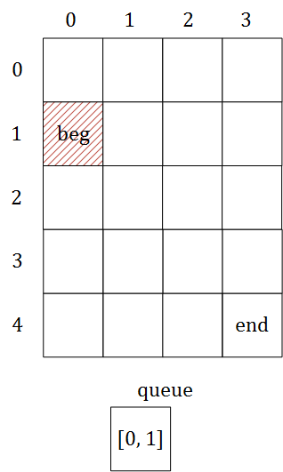

&emsp;&emsp;\((1)\)初始时将\(beg = [0,1]\)染红并加入\(queue\)； 

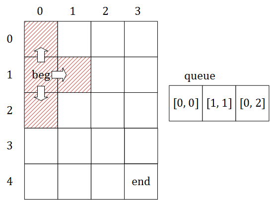

&emsp;&emsp;\((2)\)从\(queue\)中取出头节点\([0,1]\)，因\([0,1] \neq end\)，将其四周未被染红的节点\([0,0]\)、\([1,1]\)、\([0,2]\)染红并加入\(queue\)； 

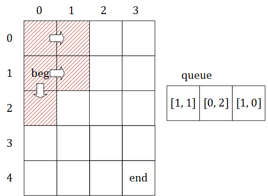

&emsp;&emsp;\((3)\)从\(queue\)中取出头节点\([0,0]\)，因\([0,0] \neq end\)，将其四周未被染红的节点\([1,0]\)染红并加入\(queue\)； 

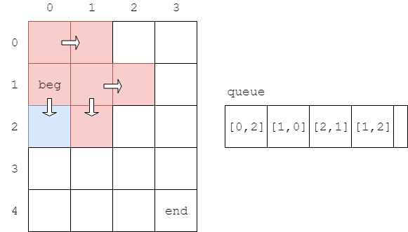

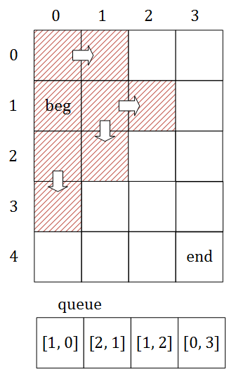

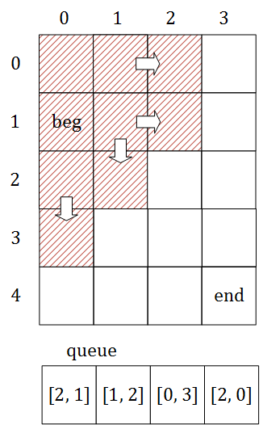

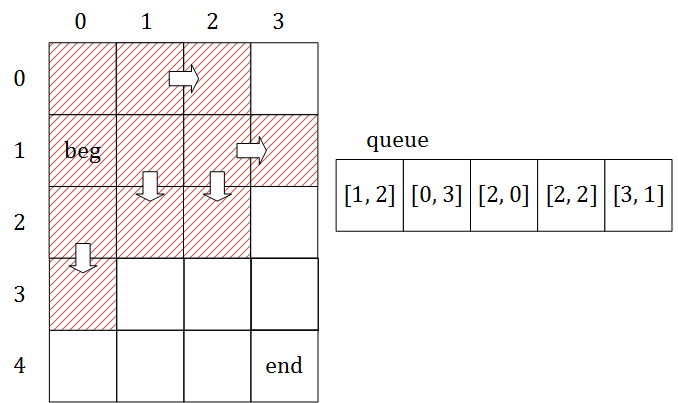

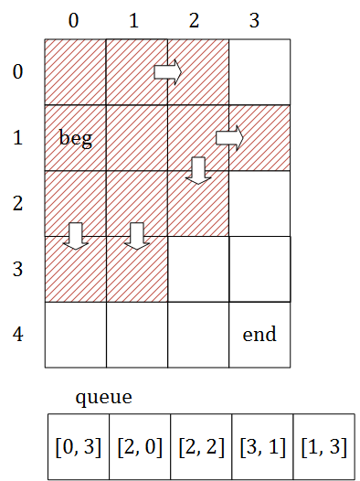

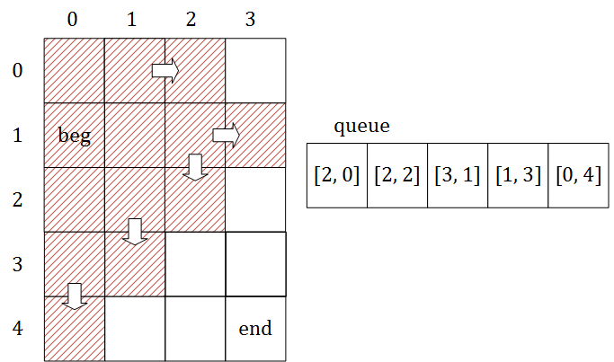

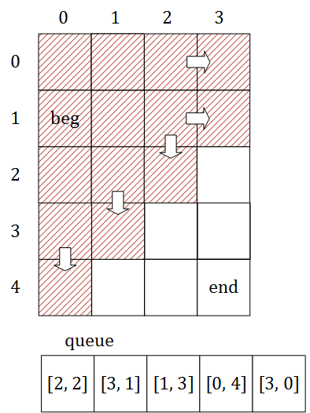

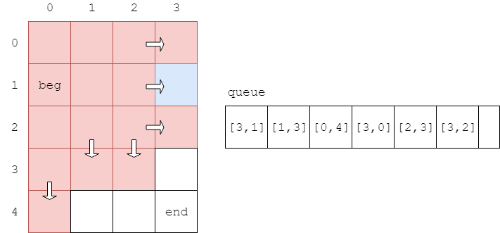

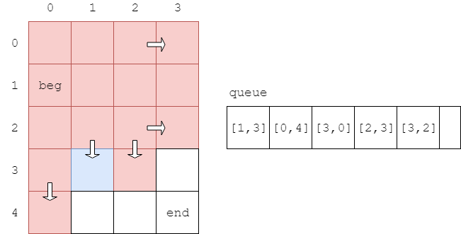

&emsp;&emsp;\((4)\)从\(queue\)中取出头节点\([3,1]\)，因\([3,1] \neq end\)，其四周的节点都已经被染红，因此不做任何操作；  

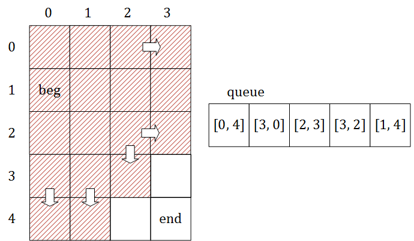

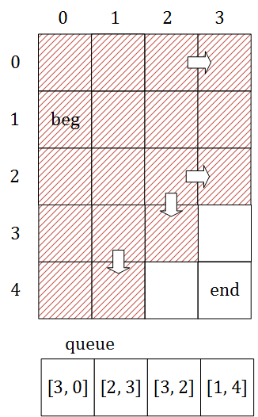

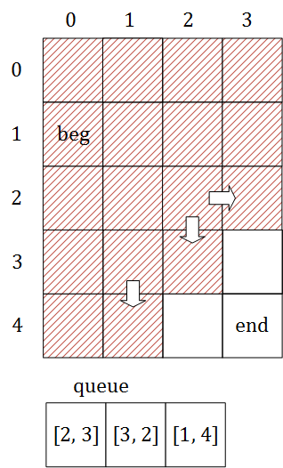

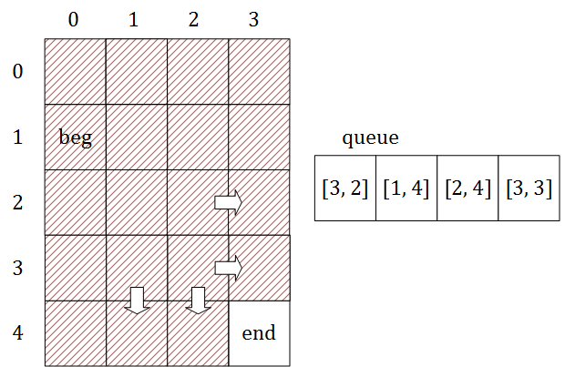

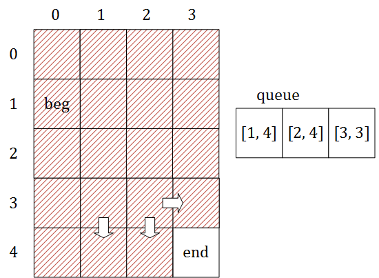

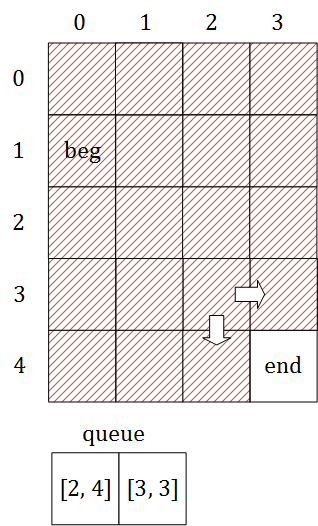

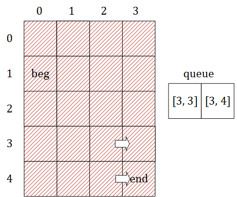

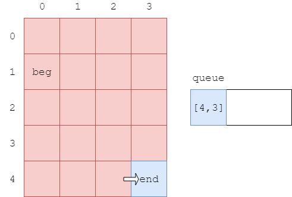

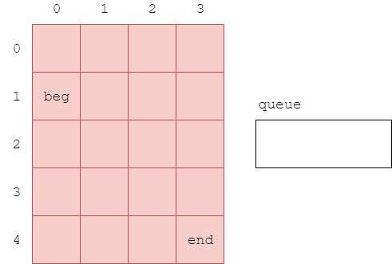

&emsp;&emsp;\((5)\)从\(queue\)中取出头节点\([3,4]\)，因\([3,4] = end\)，算法结束；  
&emsp;&emsp;上列图中的队列\(queue\)中，左边为头部，右边为尾部，新访问的节点插入队列尾部，每次从队列中取出头节点\(e\)。如果需要额外的获取从\(beg\)点到\(end\)点的完整路径，需要在遍历时标记每个节点的上一个点，即“父节点”，最终可以从\(end\)通过父节点指针逆向的找到一条回到\(beg\)点的路径。  
&emsp;&emsp;该算法下时间复杂度为\(O(m \times n)\)。  

--------
--------
