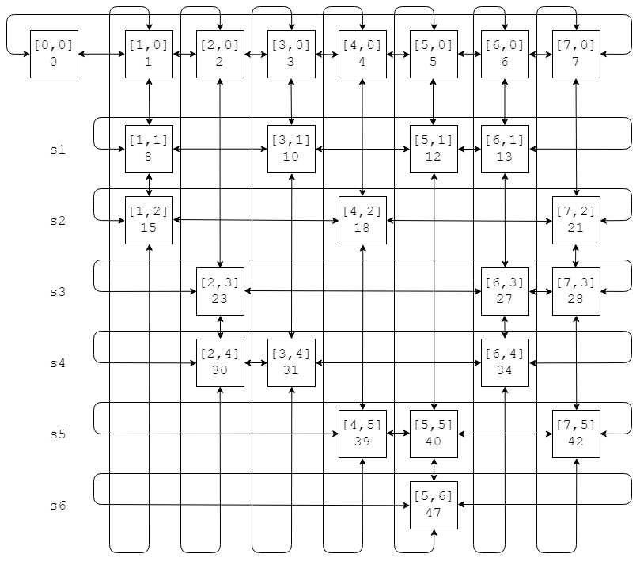
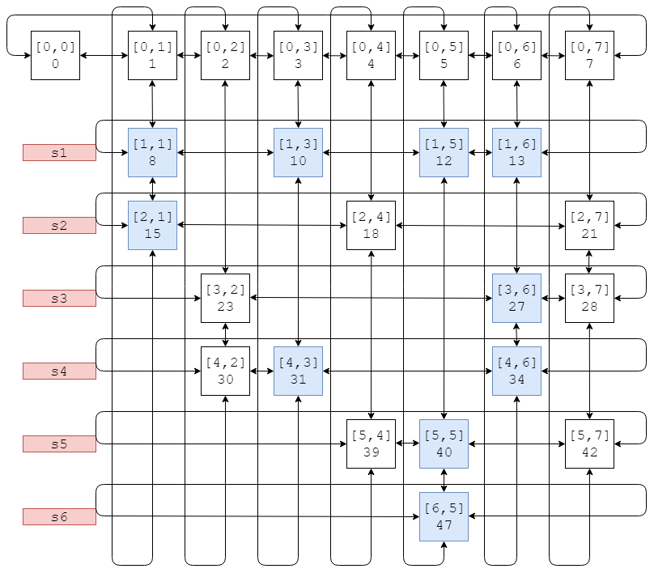
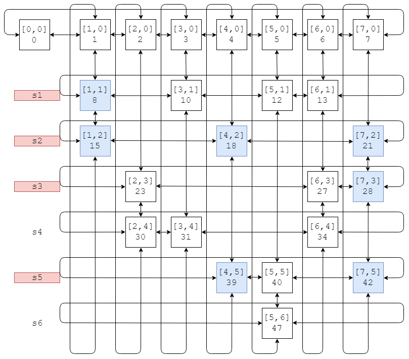
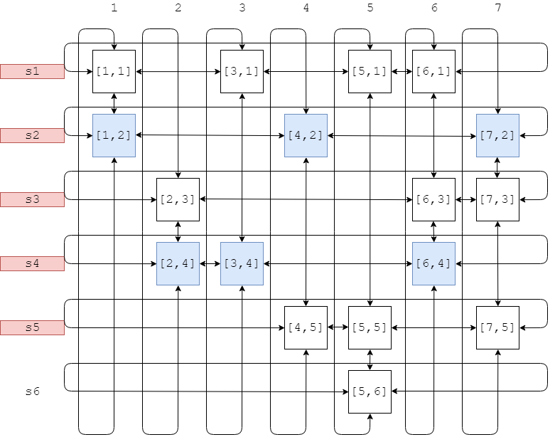
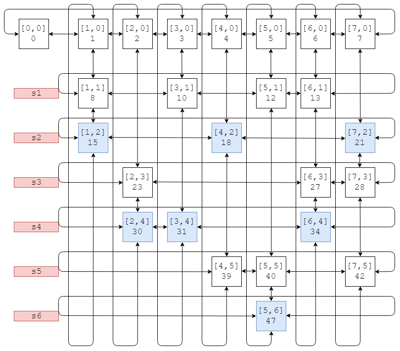
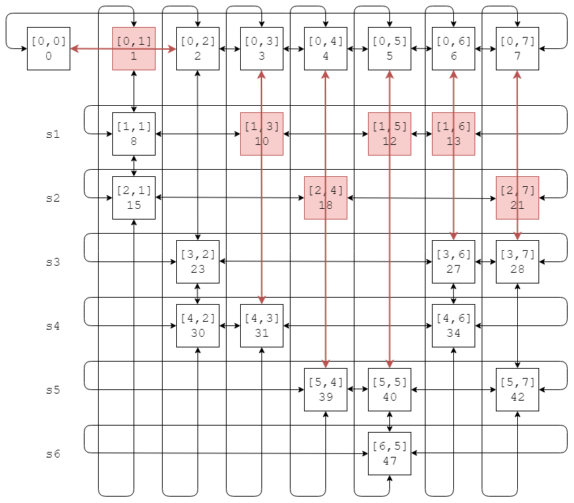
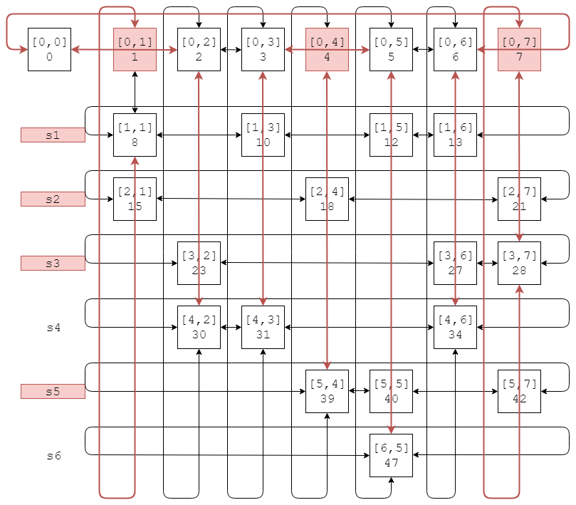

# Dancing Link - 舞蹈链

--------

#### 问题

集合$$ s = [x_{1}, x_{2}, \dots , x_{m}] $$拥有$$ m $$个元素，集合$$ t = [ s_{1},s_{2}, \dots ,s_{n} ] $$拥有$$ n $$个元素，其中任意$$ s_{i} $$是集合$$ s $$的一个子集，$$ s_{i} $$包含$$ s $$中元素的数量为$$ n_{i} $$（$$ 1 \le i \le n, 0 \le n_{i} \le m $$）。

集合$$ p $$是$$ t $$的一个子集，且$$ p $$中的子集所包含的$$ s $$的元素可以覆盖集合$$ s $$。设集合$$ q $$是$$ p $$中所有元素所包含的$$ s $$中元素组成的集合。例如

$$
\begin{matrix}
s & = & [1, 2, 3, 4, 5, 6, 7, 8, 9]     \\
t & = & [ s_1, s_2, s_3, s_4, s_5 ]     \\
p & = & [ s_2, s_4, s_5 ]               \\
q & = & [ 2, 3, 4, 5, 7, 8, 9 ]
\end{matrix}
$$

其中

$$
\begin{matrix}
s_1 &   = & [1, 2, 3]         \\
s_2 &   = & [2, 3, 4, 5]      \\
s_3 &   = & [6]               \\
s_4 &   = & [7, 8]            \\
s_5 &   = & [8, 9]            \\
\end{matrix}
$$

重复覆盖：对于$$ \forall x \in s $$，存在至少一个$$ \exists s_{i} \in p $$使得$$ x \in s_{i} $$。例如集合$$ s = [ 0,1,2,3 ] $$，子集$$ s_{1} = [ 0,1 ], s_{2} = [ 1,2 ], s_{3} = [ 1,3 ] $$组成$$ p = [ s_{1},s_{2},s_{3} ] $$，称这样的$$ p $$是$$ s $$的重复覆盖。显然$$ p $$允许两个$$ s_{i} \bigcap s_{j} \ne \varnothing $$。

精确覆盖：对于$$ \forall x \in s $$，存在且只存在一个$$ \exists s_{i} \in p $$使得$$ x \in s_{i} $$。例如集合$$ s = [ 0,1,2,3 ] $$，子集$$ s_{1} = [ 0,1 ], s_{2} = [ 1,2 ], s_{3} = [ 2,3 ] $$组成$$ p = [ s_{1},s_{2} ] $$，称这样的$$ p $$是$$ s $$的精确覆盖。显然$$ p $$必然满足$$ \forall s_{i}, s_{j} \in p, s_{i} \bigcap s_{j} = \varnothing, i \ne j $$。

求集合$$ s $$和子集集合$$ t = [s_{1}, s_{2}, \dots, s_{n}] $$的重复覆盖和精确覆盖。

#### 重复覆盖

设初始时重复覆盖$$ p = \varnothing $$，$$ p $$的所有子集中的元素所组成的集合为$$ q = \varnothing $$。对于$$ \forall x \in s $$，若$$ x \notin q $$，则在$$ t $$中寻找$$ s_{i} $$满足$$ x \in s_{i} $$，将该子集加入重复覆盖中$$ p = [ s_{i} ] $$，将所有$$ \forall y \in s_{i} $$都加入$$ q $$。每个子集只能加入$$ p $$中一次，不能重复加入。当然也可以用染色来标记所有子集$$ t = [ s_{1}, s_{2}, \dots ,s_{n} ] $$中已经加入$$ p $$的那些元素，防止重复。

遍历完成后$$ p $$即为重复覆盖。求重复覆盖的时间复杂度为$$ O(n \times m) $$。

#### 精确覆盖

设初始时精确覆盖$$ p = \varnothing $$，$$ p $$的所有子集中的元素所组成的集合为$$ q = \varnothing $$。

对于$$ \forall x \in s $$，每个包含$$ x $$的子集都可能是$$ p $$的一员，我们用递归的方式寻找所有可能。利用$$ p $$中任意两子集的交集为空的特性，若$$ x \in s_{i} $$且$$ s_{i} \in p $$，那么只要$$ s_{j} \bigcap s_{i} \ne \varnothing  $$，那么必然$$ s_{j} \notin p $$。

初始时将$$ t $$中的所有子集标记为白色（未被使用过）。遍历$$ s $$的所有元素$$ \forall x \in s $$，进行以下步骤：

若$$ x \notin q $$，这时有$$ k $$个候选子集$$ [ s_{i}, s_{j}, \dots ] $$（非红色，即未被使用过），它们都包含$$ x $$。遍历这$$ k $$个候选子集，假定选择$$ s_{i} $$加入$$ p $$，将所有$$ \forall y \in s_{i} $$加入$$ q $$。然后将$$ t $$中所有包含$$ s_{i} $$中元素的其他子集染红（标记为已被使用）；

重复上述过程只有两种结果：

$$ (1) $$ 所有$$ x $$都已经加入$$ q $$，这时的$$ p $$即为精确覆盖；

$$ (2) $$ 所有$$ x $$还没都加入$$ q $$，这时所有的子集$$ t = [s_{1}, s_{2}, \dots ,s_{n}] $$都已经被染红。说明上次在候选子集中做出的选择是错的。

我们需要记录每次选择时染红了哪些子集，以及当时遍历到的元素$$ x $$。将$$ s_{i} $$这次选择回退，把当时染红的子集重新染回白色，然后选择下一个候选者$$ s_{j} $$，再重复上述过程，指导找到精确覆盖。该过程是递归的。

下面演示舞蹈链算法：

$$
\begin{matrix}
s = [1, 2, 3, 4, 5, 6, 7]               \\
t = [ s_1, s_2, s_3, s_4, s_5, s_6 ]    \\
s_{1} = [1, 3, 5, 6]    \\
s_{2} = [1, 4, 7]       \\
s_{3} = [2, 6, 7]       \\
s_{4} = [2, 3, 6]       \\
s_{5} = [4, 5, 7]       \\
s_{6} = [5]
\end{matrix}
$$

其中$$ n = 6, m = 7 $$。

用行来表示子集，列来表示集合中的元素，可得$$ n $$行$$ m $$列矩阵：

舞蹈链算法用十字链表这种特别的数据结构将所有元素串联起来，坐标为$$ [i, j] $$的节点下标是$$ i \times m + j $$，表示$$ j \in s, j \in s_{i} $$。沿着十字链表的行可以遍历子集$$ s_{i} $$的所有元素，沿着十字链表的列可以遍历所有包含$$ j $$的子集。

$$ (1) $$ 对于上图中的示例，元素$$ x = 1 $$的候选子集有$$ s_{1}, s_{2} $$，假定选择$$ s_{1} $$，可得$$ p = [s_{1}], q = [1, 3, 5, 6] $$，然后将所有包含$$ q $$中元素的子集染红（$$ s_{1}, s_{2}, s_{3}, s_{4}, s_{5}, s_{6} $$）；

$$ (2) $$ 接着考虑元素$$ x = 2 $$，其候选子集有$$ s_{3}, s_{4} $$，但它们都被染红了无法使用，这时不存在一个可用的子集，说明上一轮选择错误。不选择上一轮的$$ s_{1} $$，将$$ s_{1}, s_{2}, s_{3}, s_{4}, s_{5}, s_{6} $$染回白色，假定选择$$ s_{2} $$，可得$$ p = [s_{2}], q = [1, 4, 7] $$，染红$$ s_{1}, s_{2}, s_{3}, s_{5} $$；

$$ (3) $$ 再次考虑元素$$ x = 2 $$，其候选子集有$$ s_{4} $$（$$ s_{3} $$已被染红），假定选择$$ s_{3} $$，可得$$ p = [s_{2}, s_{4}], q = [1, 2, 3, 4, 6, 7] $$，染红$$ s_{1}, s_{3}, s_{4} $$（$$ s_{1}, s_{3} $$上一轮已被染红）；

$$ (4) $$ 元素$$ 3, 4 \in q $$，因此可以直接跳过；

$$ (5) $$ 考虑元素$$ x = 5 $$，其候选子集有$$ s_{6} $$（$$ s_{5} $$已被染红），假定选择$$ s_{6} $$，可得$$ p = [s_{2}, s_{4}， s_{6}], q = [1, 2, 3, 4, 5, 6, 7] $$，染红$$ s_{5}, s_{6} $$（$$ s_{5} $$之前已被染红）；

$$ (6) $$ 元素$$ 6, 7 \in q $$，可以直接跳过。至此$$ s = q $$，所有元素都被覆盖到，并且$$ p = [s_{2}, s_{4}, s_{6}] $$中任意两子集的交集为空，算法结束。

其实十字链表并不需要“染红”这个操作来标记一个子集是否可以使用，而是用添加、删除来操作链表上的节点。例如元素$$ x = 1 $$选择子集$$ s_{2} = [1, 4, 7] $$时，将节点$$ 1 $$从头节点一行中删除，将包含$$ x = 1 $$的子集$$ [s_{1}, s_{2}] $$（包括$$ s_{2} $$自己）的元素也从所在的列中删除。如图所示：

仔细观察可知，删除之后仍然能够判定$$ s_{1}, s_{2} $$包含元素$$ 1 $$（$$ [1, 8, 15] $$拥有列关系），且可知$$ s_{1} = [1, 3, 5, 6], s_{2} = [1, 4, 7] $$（$$ [8, 10, 12, 13] $$，$$ [15, 18, 21] $$拥有行关系）。这些遗留的列表指针可以恢复错误选择。对于子集$$ s_{2} = [1, 4, 7] $$上的所有元素进行相同的链表操作，等价于将$$ s_{1}, s_{2}, s_{3}, s_{5} $$染红：

若尝试所有子集组合后仍无法找出精确覆盖，则说明该条件下不存在精确覆盖。舞蹈链算法的时间复杂度与递归的时间复杂度一样是$$ O(n^m) $$。

--------

#### 源码

[DancingLink.h](https://github.com/linrongbin16/Way-to-Algorithm/blob/master/src/Search/DancingLink.h)

[DancingLink.cpp](https://github.com/linrongbin16/Way-to-Algorithm/blob/master/src/Search/DancingLink.cpp)

#### 测试

[DancingLinkTest.cpp](https://github.com/linrongbin16/Way-to-Algorithm/blob/master/src/Search/DancingLinkTest.cpp)
