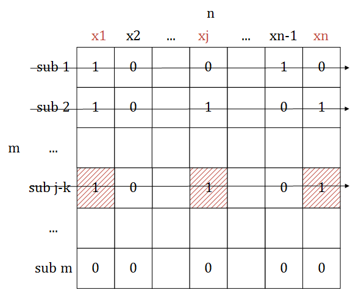
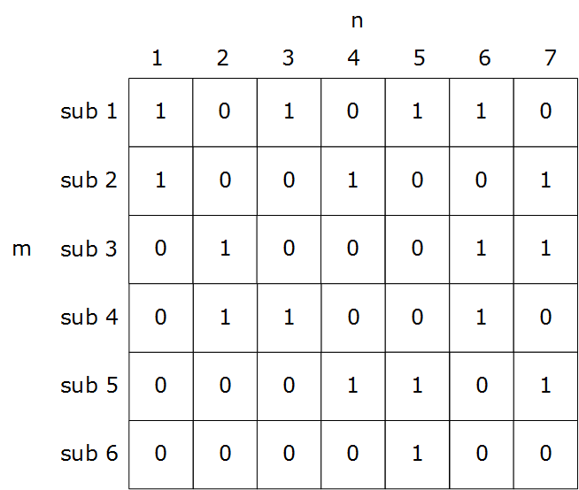
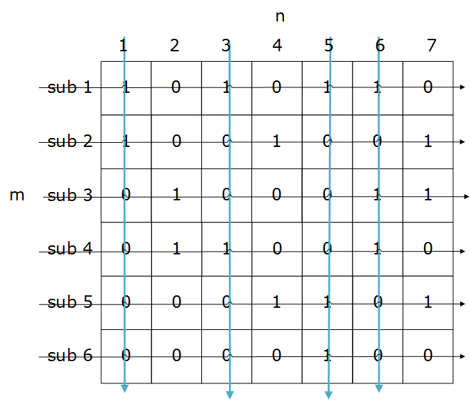
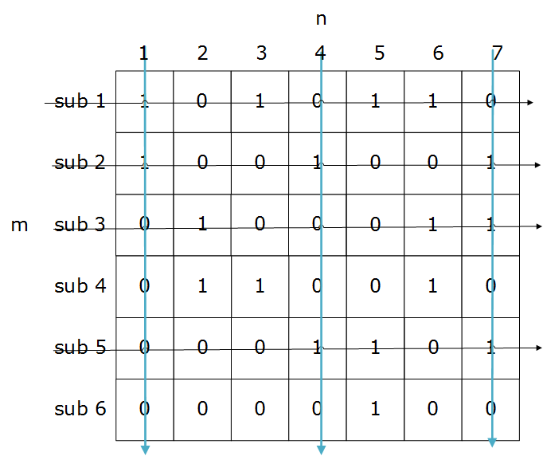
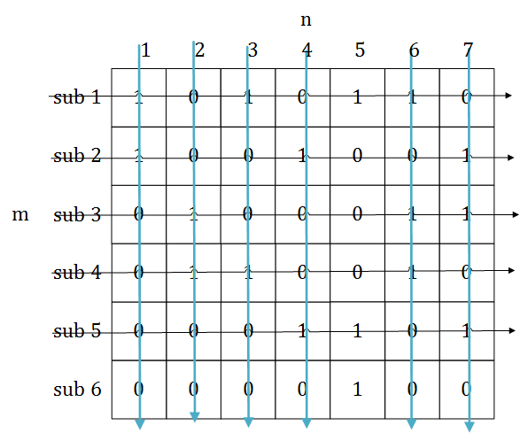
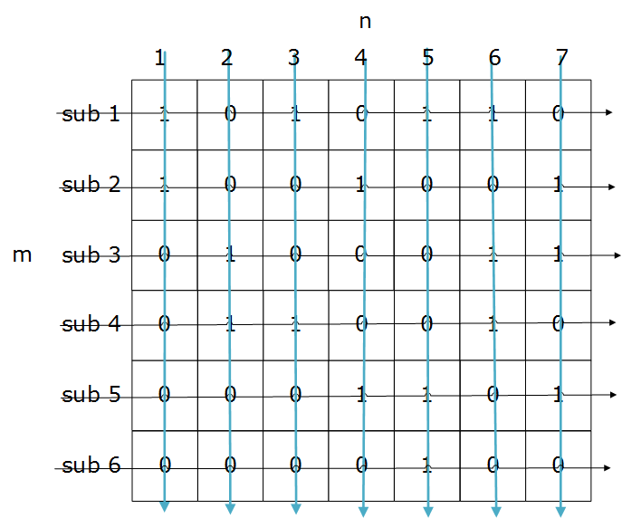
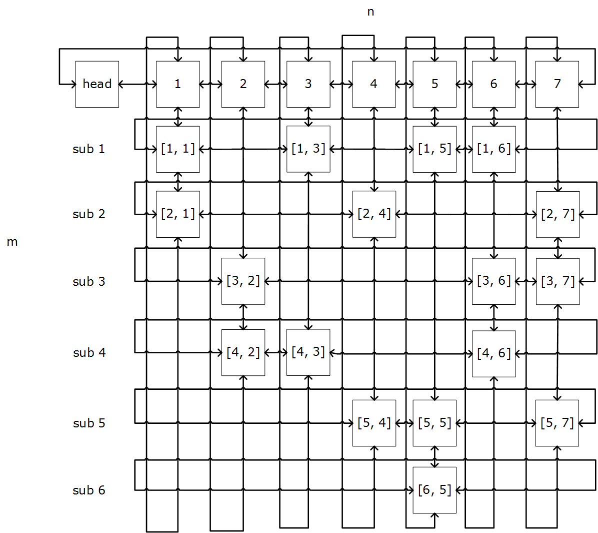
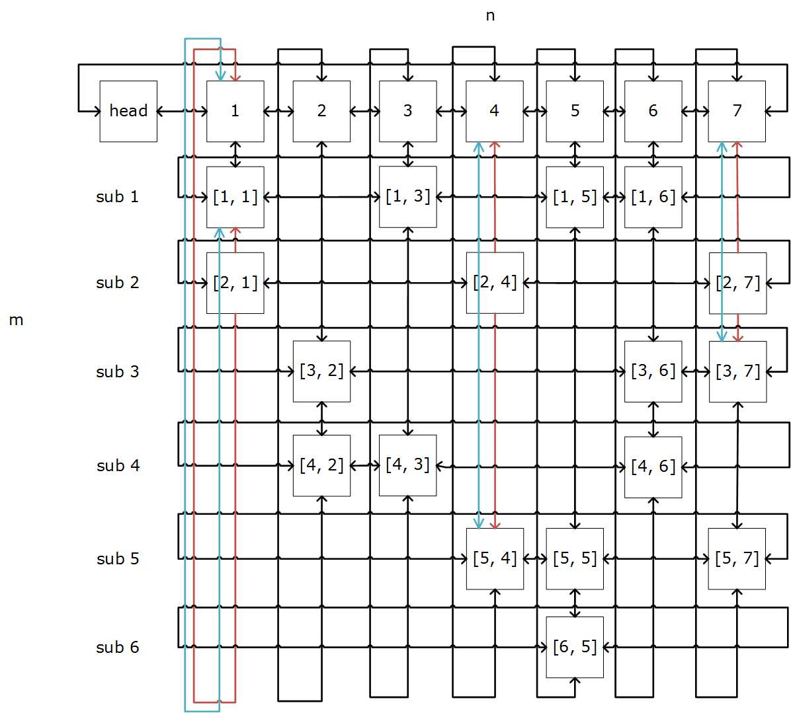
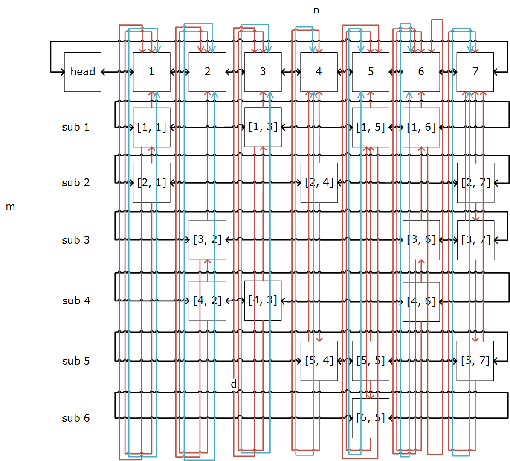

--------
[Upper Folder - 上一级目录](../)

--------

<h1 align="center">Dancing Links</h1>
<h1 align="center">舞蹈链</h1>
 
问题：  
&emsp;&emsp;集合\(s = {x_1,x_2, \cdots ,x_n}\)拥有\(n\)个成员，现在集合\(s\)有\(m\)个子集\({sub_1,sub_2, \cdots ,sub_m}\)。在\(m\)个子集中选择一些组成集合\(t={sub_1,sub_2, \cdots }\)，使\(t\)中包含的成员可以覆盖集合\(s\)，即\(s\)中所有成员都属于\(t\)中的某个或某些子集。  
&emsp;&emsp;重复覆盖：集合\(s\)中的任意成员\(\forall x \epsilon t\)（允许同时属于两个以上的子集）。例如集合\(s = {0,1,2,3}\)，在子集\(sub_1 = {0,1}\)、\(sub_2 = {1,2}\)、\(sub_3 = {1,3}\)中选择\(t = {sub_1,sub_2,sub_3}\)即可重复覆盖\(s\)。  
&emsp;&emsp;精确覆盖：集合\(s\)中的任意成员\(x\)属于且只属于\(t\)中的一个子集，不能出现\(x\)不属于\(t\)中的任何子集，或者\(x\)同时属于\(t\)中两个以上的子集。例如集合\(s = {0,1,2,3}\)，在子集\(sub_1 = {0,1}\)、\(sub_2 = {1,2}\)、\(sub_3 = {2,3}\)中选择\(t = {sub_1,sub_2}\)即可精确覆盖\(s\)。  
给定集合\(s\)和\(m\)个子集，求其重复覆盖和精确覆盖。  
 
重复覆盖解法：  
&emsp;&emsp;遍历集合\(s\)中每个成员\(x\)，若其尚未被包含在\(t\)中，则在\(m\)个集合中寻找一个包含\(x\)的子集加入\(t\)中，重复该步骤即可获得重复覆盖。  
 
精确覆盖解法：  
&emsp;&emsp;对于每个元素\(x_j\)（\(1 \le j \le n\)），所有包含它的子集都是一种可能的选择。对于包含元素\(x_j\)的所有子集\(t_j = {sub_{j-1},sub_{j-2}, \cdots ,sub_{j-p}}\)（共\(p_j\)个），依次尝试选择每个子集\(sub_{j-k}\)（\(1 \le k \le p)）作为我们的精确覆盖。当选择子集\(sub_{j-k}\)时，它除了\(x_j\)之外还会包含其他元素，设其他元素的集合为\(X_j\)，那么所有其他包含\(X_j\)元素的子集，都与子集\(sub_{j-k}\)冲突，因此这次选择后，需要将\(sub_{j-k}\)和所有与它冲突的集合都删除。  

&emsp;&emsp;上图中，当为了元素\(x_j\)选择子集\(sub_{j-k}\)后，由于\(sub_{j-k}\)也包含\(x_1\)、\(x_n\)，所以需要删除所有包含\(x_1\)、\(x_n\)元素的其他子集，即\(sub_1\)、\(sub_2\)。经过这次操作后，被覆盖的元素有\({x_1,x_j,x_n}\)，被选中作为精确覆盖的子集为\(sub_{j-k}\)，被删除的子集有\({sub_1,sub_2,sub_{j-k}}\)。然后重复上述操作，继续考察下一个元素\(x_{j+1}\)，直到覆盖所有元素，则找到一组精确覆盖；若所有子集都被删除掉时，却无法覆盖到所有元素，则说明最近的一次选择是错误的，这时我们就放弃子集\(sub_{j-k}\)，并放弃之前的操作（被覆盖的元素中去掉\({x_1,x_j,x_n}\)，精确覆盖中去掉子集\(sub_{j-k}\)，被删除的子集中去掉\({sub_1,sub_2,sub_{j-k}}\)），然后考虑下一个包含\(x_j\)的子集。  
&emsp;&emsp;求精确覆盖的算法称为X算法，将集合\(s\)中的\(n\)个成员看作列，将\(m\)个子集看作行，组成一个\(m \times n\)的矩阵\(d\)。若子集\(sub_i\)（其中\(1 \le i \le m\)）包含某个成员\(x_j\)（其中\(1 \le j \le n\)），则\(d[i,j] = 1\)；若不包含则\(d[i,j] = 0\)。  
 
&emsp;&emsp;例如对于集合\(s = {1,2,3,4,5,6,7}\)，它有\(n = 7\)个成员，还有\(m = 6\)个子集\(sub_1 = {1,3,5,6}\)、\(sub_2 = {1,4,7}\)、\(sub_3 = {2,6,7}\)、\(sub_4 = {2,3,6}\)、\(sub_5 = {4,5,7}\)、\(sub_6 = {5}\)的情况，如下图所示：  

&emsp;&emsp;(1)从1开始遍历集合\(s\)中每个成员，对于成员1，遍历所有子集，找到第一个满足\(d[i,1] = 1\)的子集\(sub_1\)，即\(i = 1\)时有\(d[1,1] = 1\)，选择该子集作为精确覆盖中的一个子集\({sub_1}\)，已经覆盖的成员有\({1,3,5,6}\)，\(sub_1 = {1,3,5,6}\)中已经包含的成员其他子集不能再出现，因此删掉其他包含\({1,3,5,6}\)的子集\(sub_2\)、\(sub_4\)、\(sub_5\)、\(sub_6\)、\(sub_3\)，将\(sub_1\)也删掉；  

&emsp;&emsp;(2)这时矩阵\(d\)中所有子集都被删除，成为空矩阵，但并没有完全覆盖集合\(s\)中所有成员，因此(1)的选择是失败的，撤销(1)中的所有操作。继续从1开始遍历集合\(s\)中每个成员，对于成员1，遍历所有子集，找到第二个满足\(d[i,1] = 1\)的子集\(sub_2\)，即\(i = 2\)时有\(d[2,1] = 1\)，选择该子集作为精确覆盖中的一个子集\({sub_2}\)，已经覆盖的成员有\({1,4,7}\)，\(sub_2 = {1,4,7}\)中已经包含的成员其他子集不能再出现，因此删掉其他包含\({1,4,7}\)的子集\(sub_1\)、\(sub_3\)、\(sub_5\)，将\(sub_2\)也删掉；  

&emsp;&emsp;(3)从2开始遍历集合\(s\)中剩下的成员，对于成员\(2\)，遍历剩余子集，找到第一个满足\(d[i,2] = 1\)的子集\(sub_4\)，即\(i = 4\)时有\(d[4,2] = 1\)，选择该子集作为精确覆盖中的一个子集\({sub_2,sub_4}\)，已经覆盖的成员有\({1,2,3,4,6,7}\)，\(sub_4 = {2,3,6}\)中已经包含的成员其他子集不能再包含，因此删掉其他包含\({2,3,6}\)的子集（没有找到），将\(sub_4\)也删掉；  

&emsp;&emsp;(4)从5开始遍历集合\(s\)中剩下的成员，对于成员5，遍历剩余子集，找到第一个满足\(d[i,5] = 1\)的子集\(sub_6\)，即\(i = 6\)时有\(d[6,5] = 1\)，选择该子集作为精确覆盖中的一个子集\({sub_2,sub_4,sub_6}\)，已经覆盖的成员有\({1,2,3,4,5,6,7}\)，\(sub_6 = {5}\)中已经包含的成员其他子集不能再包含（没有找到），将\(sub_6\)删掉后矩阵\(d\)即为空矩阵，并且已经完全覆盖了子集\(s\)中的所有成员，则精确覆盖的结果为\({sub_2,sub_4,sub_6}\)，算法结束；  

&emsp;&emsp;(5)当算法进行到矩阵\(d\)为空矩阵，但集合\(s\)中所有成员并没有被完全覆盖的情况时，说明某一次的子集选择有错误，将该次选择的操作进行恢复，并寻找下一个覆盖要求的子集，继续尝试，直到找到精确覆盖；  
&emsp;&emsp;回溯法的递归结束条件是矩阵\(d\)为空，每次递归时选择矩阵中的一列\(x_j\)（其中\(0 \le j \le n\)），遍历矩阵\(d\)中的所有子集（行），找到一子集\(sub_i\)（其中\(0 \le i \le m\)）满足\(d[i,j] = 1\)，选择该子集（行）。由于精确覆盖的要求，其他包含该子集中任意成员的子集，都不能再选择，将其删掉，并将子集\(sub_i\)也删掉。重复这个操作直到将矩阵\(d\)删空，检查矩阵\(d\)为空时是否集合\(s\)的所有成员都被覆盖到。在选取包含某个成员\(x_j\)的子集时，可能有多个选择，若选择其中一个子集无法最终将集合\(s\)完全覆盖，则在递归函数中返回这一层，尝试其他子集，直到找出精确覆盖。  
&emsp;&emsp;十字链表是一种方便删除矩阵\(d\)中的行列、以及恢复行列的数据结构。每个节点有上下左右4个指针指向周围的节点。现在将上文的集合\(s = {1,2,3,4,5,6,7}\)、6个子集以及5个步骤，用十字链表的形式重复一遍。建立十字链表时需要额外对每一列添加头节点，并添加一个总的head节点连接所有列的头节点，如图所示：  

&emsp;&emsp;(1)选取head节点右边的节点1（第1列），在第1列中从上到下依次考虑每个子集，看是否最终可以得到精确覆盖，第1列有2个选择\(sub_1\)、\(sub_2\)，首先尝试选择\(sub_1\)。根据上文可知，目标是将包含\(sub_1\)成员\({1,3,5,6}\)的所有子集都删除掉，即删除\(sub_1\)、\(sub_2\)、\(sub_4\)、\(sub_5\)、\(sub_6\)、\(sub_3\)。在十字链表中这个过程分为以下几个步骤来依次进行；  
&emsp;&emsp;(2)将\(sub_1\)的所有成员\([1,1]\)、\([1,3]\)、\([1,5]\)、\([1,6]\)首先删除；  

&emsp;&emsp;(3)再依次将属于\({1,3,5,6}\)列上的所有节点，以及其所在子集（行）上的所有节点，都删除掉；  

&emsp;&emsp;(4)这时矩阵\(d\)为空，所选子集为\({sub_1}\)，覆盖的成员为\({1,3,5,6}\)，没有完全覆盖，因此选择错误，恢复\({1,3,5,6}\)列的所有元素，然后继续尝试第1列（节点1）的下一个节点\([2,1]\)，直到找到精确覆盖；  
&emsp;&emsp;舞蹈链算法的时间复杂度与递归的时间复杂度一样，为\(O(n^m)\)。  

--------
--------
