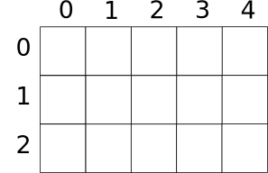
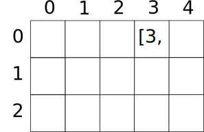

* [Upper Folder - 上一级目录](../)

--------

### Knowledge Point
### 知识要点

一个矩阵的示例\(m\)如下图： 

我们称之为\(3\)行\(5\)列的矩阵，在计算机程序中一般用二位数组\(m = 5 \times 3\)表示，\(m[col, row]\)表示第\(col\)行、第\(row\)列的元素（也可以颠倒过来表示成\(m[row, col]\)，只需要保证统一即可）。比如： 

本书中我们总是将第\(1\)维作为列\(col\)，将第\(2\)维作为行\(row\)。 

