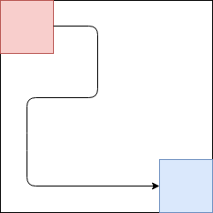
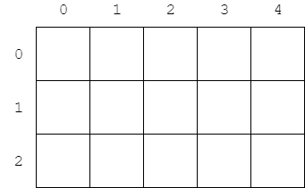
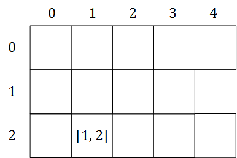
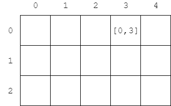

# Chapter-2 Search
# 第2章 搜索

--------

1. [BinarySearch 二分查找法（折半查找法）](BinarySearch/README.md)
2. [BruteForce 暴力枚举](BruteForce/README.md)
3. [Recursion 递归](Recursion/README.md)
4. [BreadthFirstSearch 广度优先搜索](BreadthFirstSearch/README.md)
5. [BidirectionalBreadthSearch 双向广度搜索](BidirectionalBreadthSearch/README.md)
6. [AStarSearch A\*搜索](AStarSearch/README.md)
7. [DancingLink 舞蹈链](DancingLink/README.md)

--------

#### 平面搜索中的矩阵

下图是一个矩阵$$ matrix $$：

我们称之为$$ 3 $$行$$ 5 $$列的矩阵，一般用二位数组$$ m = 3 \times 5 $$表示，$$ matrix[row, col] $$表示第$$ row $$行、第$$ col $$列的元素。比如：

