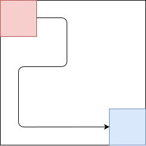

# Chapter-2 Search
# 第2章 搜索

--------

1. [KnowledgePoint 知识要点](KnowledgePoint/README.md)
2. [BinarySearch 二分查找法（折半查找法）](BinarySearch/README.md)
3. [BruteForce 暴力枚举](BruteForce/README.md)
4. [Recursion 递归](Recursion/README.md)
5. [BreadthFirstSearch 广度优先搜索](BreadthFirstSearch/README.md)
6. [BidirectionalBreadthSearch 双向广度搜索](BidirectionalBreadthSearch/README.md)
7. [AStarSearch A\*搜索](AStarSearch/README.md)
8. [DancingLinks 舞蹈链](DancingLinks/README.md)

--------

#### 平面搜索中的矩阵

一个矩阵的示例$$ m $$如下图：

我们称之为$$ 3 $$行$$ 5 $$列的矩阵，在计算机程序中一般用二位数组$$ m = 5 \times 3 $$表示，$$ m[col, row] $$表示第$$ col $$行、第$$ row $$列的元素（也可以颠倒过来表示成$$ m[row, col] $$，只需要保证统一即可）。比如：

本节中我们将第$$ 1 $$维作为列$$ col $$，将第$$ 2 $$维作为行$$ row $$。

