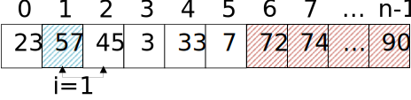
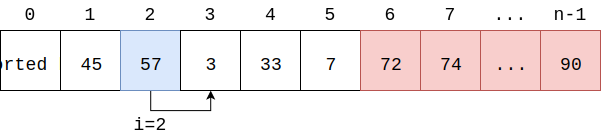
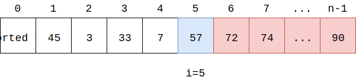
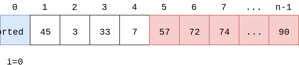

# Bubble Sort - 冒泡排序

--------

#### 问题

用冒泡排序对长度为$$ n $$的无序序列$$ s $$进行排序。

#### 解法

本问题对无序序列$$ s $$升序排序，排序后$$ s $$是从小到大的。

将长度为$$ n $$的序列$$ s $$分为$$ left $$和$$ right $$两个部分，其中$$ left $$是无序部分，范围为$$ s[0,k] $$，$$ right $$是有序部分，范围为$$ s[k+1,n-1] $$，其中$$ 0 \lt k \le n $$。初始时$$ left $$范围为$$ s[0,n-1] $$，$$ right $$为空。

$$ left $$从左边第一个元素$$ s[i] $$（初始时$$ i = 0 $$）开始向右遍历，依次对$$ s[i] $$和$$ s[i+1] $$进行比较，若$$ s[i] \gt s[i+1] $$则交换两个元素，直到$$ i = k $$为止，完成一次遍历操作。每次遍历会将$$ left $$中的最大元素移动到$$ s[0,k] $$的最右边，之后就可以将$$ left $$的范围缩小为$$ s[0,k-1] $$，$$ right $$的范围扩大为$$ s[k,n-1] $$。

例如对于下图中的数组$$ s $$，$$ left $$为$$ s[0,5] $$，$$ right $$为$$ s[6,n-1] $$。从$$ i = 0 $$开始向右遍历，依次比较$$ s[i] $$和$$ s[i+1] $$，若$$ s[i] \gt s[i+1] $$则交换两个元素，直到$$ i = 5 $$。

$$
\cdots \cdots
$$

然后将$$ left $$中的最大值$$ s[5] = 57 $$合并到$$ right $$部分中，再进行新一轮的遍历交换操作。

重复上面的遍历交换操作，从$$ i = 0 $$开始向右遍历。这样直到$$ left $$部分为空，$$ right $$部分即为已序数组，算法结束。对于长度为$$ n $$的序列$$ s $$，每一轮将$$ left $$中的最大值移动到$$ right $$，时间复杂度为$$ O(n) $$，总共需要$$ n $$轮，该算法的时间复杂度为$$ O(n^2) $$。

--------

#### 源码

[import, lang:"c_cpp"](../../../src/Sort/BubbleSort.h)

#### 测试

[import, lang:"c_cpp"](../../../src/Sort/BubbleSort.cpp)
