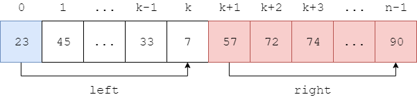
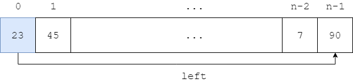
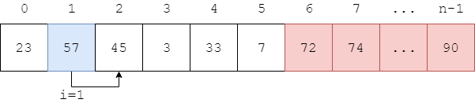
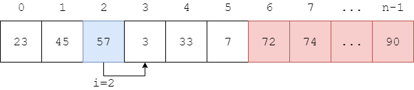
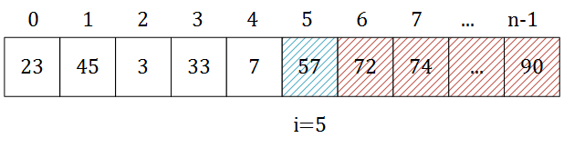
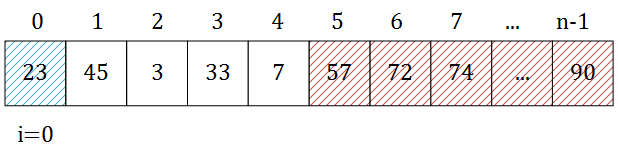

# Bubble Sort - 冒泡排序

--------

#### 问题

用Bubble Sort对长度为$$ n $$的无序序列$$ s $$从小到大（升序）排序。

#### 解法

将长度为$$ n $$的序列$$ s = [x_0, x_1, \dots, x_{n-1}] $$分为$$ left = [x_0, \dots, x_k] $$和$$ right = [x_{k+1}, \dots, x_{n-1}] $$两个部分（$$ 0 \lt k \leq n $$），其中$$ left $$是无序的，$$ right $$是有序的。如图所示：

初始时$$ left $$与$$ s $$相同，即$$ [x_0, \dots, x_{n-1}] $$，$$ right $$为空，即$$ [] $$。如图所示：

从左向右遍历$$ left $$中的所有元素$$ s[i] $$（$$ 0 \leq i \leq k $$）。依次比较$$ s[i] $$和$$ s[i+1] $$，若$$ s[i] \gt s[i+1] $$则交换两个元素，否则不做任何操作。这样一次遍历会将$$ left $$中的最大元素移动到最右边，然后将$$ left $$最右边的元素弹出，从左边加入$$ right $$中。

例如对于下图中的数组$$ s $$，$$ left $$为$$ s[0,5] $$，$$ right $$为$$ s[6,n-1] $$。从$$ i = 0 $$开始向右遍历，依次比较$$ s[i] $$和$$ s[i+1] $$，若$$ s[i] \gt s[i+1] $$则交换两个元素，直到$$ i = 5 $$。

$$
\cdots \cdots
$$

然后将$$ left $$中的最大值$$ s[5] = 57 $$合并到$$ right $$部分中，再进行新一轮的遍历交换操作。

每次遍历都可以筛选出$$ left $$中最大的元素，重复$$ n $$次即可对整个数组完成排序，算法结束。该算法的时间复杂度为$$ O(n^2) $$。

--------

#### 源码

[BubbleSort.h](https://github.com/linrongbin16/Way-to-Algorithm/blob/master/src/Sort/BubbleSort.h)

[BubbleSort.cpp](https://github.com/linrongbin16/Way-to-Algorithm/blob/master/src/Sort/BubbleSort.cpp)

#### 测试

[BubbleSortTest.cpp](https://github.com/linrongbin16/Way-to-Algorithm/blob/master/src/Sort/BubbleSortTest.cpp)
