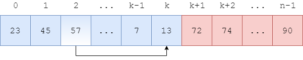
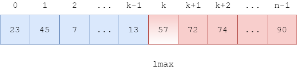

<script type="text/javascript" src="https://cdnjs.cloudflare.com/ajax/libs/mathjax/2.7.1/MathJax.js?config=TeX-AMS-MML_HTMLorMML"></script>

# Bubble Sort - 冒泡排序

--------

#### 问题

用Bubble Sort对长度为$$ n $$的无序序列$$ s $$从小到大（升序）排序。

#### 解法

将长度为$$ n $$的序列$$ s = [x_0, x_1, \dots, x_{n-1}] $$分为左右两个部分，未排序的$$ left = [x_0, \dots, x_k] $$和已排序的$$ right = [x_{k+1}, \dots, x_{n-1}] $$，其中$$ 0 \le k \le n-1 $$。如图：


初始时$$ left = [x_0, \dots, x_{n-1}], right = \varnothing $$。如图：


对$$ left $$做如下操作：

```
function bubble(s, k):
    for i = [0, k]
        if s[i] > s[i+1]
            swap(s[i], s[i+1])
```

(1) bubble函数第2行：从左向右遍历$$ left $$中的所有元素$$ s[i] $$；

(2) bubble函数第3-4行：比较$$ s[i] $$和$$ s[i+1] $$，若$$ s[i] \gt s[i+1] $$则交换两个元素，否则不做任何操作。这样一次操作会将$$ left $$中的最大元素移动到最右边，下一次调用bubble函数时，只需要将输入参数$$ k $$变为$$ k - 1 $$，就可以将上一次$$ left $$最右边的元素加入$$ right $$的最左边；

上述操作如图：





运行一次bubble函数可以将$$ left $$中最大的元素移动到$$ right $$最左边（$$ left $$长度减1，$$ right $$长度加1）。初始时$$ left $$长度为$$ n $$，$$ right $$长度为$$ 0 $$，只需重复调用$$ n $$次bubble函数即可完成排序：

```
function bubble_sort(s, n):
    for k = [n-1, 0]
        bubble(s, k)
```

例如对于下图中的数组$$ s $$，$$ left $$为$$ s[0,5] $$，$$ right $$为$$ s[6,n-1] $$。从$$ i = 0 $$开始向右遍历，依次比较$$ s[i] $$和$$ s[i+1] $$，若$$ s[i] \gt s[i+1] $$则交换两个元素，直到$$ i = 5 $$。


$$
\cdots
$$


然后将$$ left $$中的最大值$$ s[5] = 57 $$合并到$$ right $$部分中，再进行新一轮的遍历交换操作。


每次遍历都可以筛选出$$ left $$中最大的元素，重复$$ n $$次即可对整个数组完成排序，算法结束。

#### 复杂度

`bubble`函数的输入规模为$$ T(k) $$，遍历$$ k $$个元素的时间复杂度为$$ O(k) $$，判断两个元素的大小、交换两元素的值的时间复杂度为$$ O(1) $$，该操作的时间复杂度为：

$$
\begin{matrix}
T(k) & = & O(k) + O(1)  \\
     & = & O(k)
\end{matrix}
$$

bubble_sort函数的输入规模为$$ T(n) $$，循环调用$$ n $$次bubble函数，时间复杂度为$$ O(n) $$，调用bubble的平均输入规模为$$ T(n) $$，该操作的时间复杂度为：

$$
\begin{matrix}
T(n) & = & O(n) \cdot O(n)  \\
     & = & O(n^2)
\end{matrix}
$$

该算法的时间复杂度为$$ O(n^2) $$。该算法没有额外占用内存（没有动态分配内存），空间复杂度为为$$ O(1) $$。

#### 源码

[BubbleSort.h](https://github.com/linrongbin16/Way-to-Algorithm/blob/master/src/Sort/BubbleSort.h)

[BubbleSort.cpp](https://github.com/linrongbin16/Way-to-Algorithm/blob/master/src/Sort/BubbleSort.cpp)

#### 测试

[BubbleSortTest.cpp](https://github.com/linrongbin16/Way-to-Algorithm/blob/master/src/Sort/BubbleSortTest.cpp)
