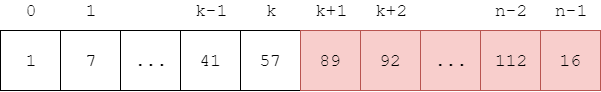
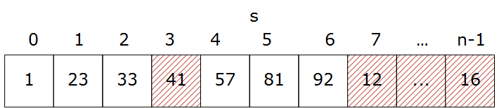
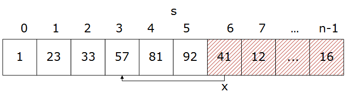

<script type="text/javascript" src="https://cdnjs.cloudflare.com/ajax/libs/mathjax/2.7.1/MathJax.js?config=TeX-AMS-MML_HTMLorMML"></script>

# Insert Sort - 插入排序

--------

#### 问题

用Insert Sort对长度为$$ n $$的无序序列$$ s $$从小到大（升序）排序。

#### 解法

将长度为$$ n $$的序列$$ s = [x_0, x_1, \dots, x_{n-1}] $$分为左右两个部分，已排序的$$ left = [x_0, \dots, x_k] $$和未排序的$$ right = [x_{k+1}, \dots, x_{n-1}] $$。如图：



其中$$ 0 \le k \lt n $$。初始时整个序列是无序的，即$$ left = \varnothing $$，$$ right = [x_0, \dots, x_{n-1}] $$。

对$$ left $$和$$ right $$进行如下操作：

```
func insert(s, k, n):
    let x = s[k+1]
    for i = [0, k]
        if (i = 0 and x < s[i]) or (i = k and s[i] < x) or (s[i-1] < x < s[i])
            move s[i...k] to s[i+1...k+1]
            let s[i] = x
```

对$$ right $$最左边的元素$$ s[k+1] $$，在$$ left $$找到一个位置$$ i $$满足$$ s[i-1] \le x \le s[i] $$（即$$ x $$可以夹在$$ s[i-1] $$和$$ s[i] $$之间）。再将$$ left $$中$$ s[i,k] $$部分的元素向右移动一个位置到$$ s[i+1,k+1] $$，$$ x $$取代原$$ s[i] $$即可。

例如下图中，$$ left $$部分为$$ s[0,5] $$，$$ right $$部分为$$ s[6,n-1] $$，$$ right $$最左边的首部元素$$ x = s[6] = 41 $$，在$$ left $$部分中合适的插入位置为$$ i = 3 $$（$$ s[2] \le x \le s[3] $$）。



将$$ s[3,5] $$向右移动一位到$$ s[4,6] $$，将原$$ x $$移动到$$ s[3] $$，就完成了一次插入。



该算法的时间复杂度为$$ O(n^2) $$。

--------

#### 源码

[InsertSort.h](https://github.com/linrongbin16/Way-to-Algorithm/blob/master/src/Sort/InsertSort.h)

[InsertSort.cpp](https://github.com/linrongbin16/Way-to-Algorithm/blob/master/src/Sort/InsertSort.cpp)

#### 测试

[InsertSortTest.cpp](https://github.com/linrongbin16/Way-to-Algorithm/blob/master/src/Sort/InsertSortTest.cpp)
