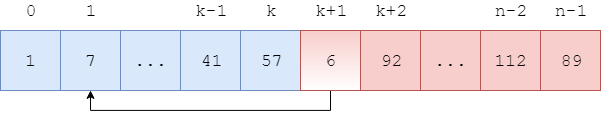
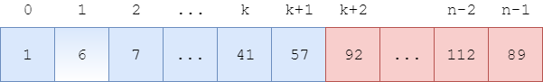

<script type="text/javascript" src="https://cdnjs.cloudflare.com/ajax/libs/mathjax/2.7.1/MathJax.js?config=TeX-AMS-MML_HTMLorMML"></script>

# Insert Sort - 插入排序

--------

#### 问题

用Insert Sort对长度为$$ n $$的无序序列$$ s $$从小到大（升序）排序。

#### 解法

将长度为$$ n $$的序列$$ s = [x_0, x_1, \dots, x_{n-1}] $$分为左右两个部分，已排序的$$ left = [x_0, \dots, x_k] $$和未排序的$$ right = [x_{k+1}, \dots, x_{n-1}] $$，其中$$ 0 \le k \le n $$。如图：


初始时$$ left = \varnothing, right = [x_0, \dots, x_{n-1}] $$。

对$$ left $$和$$ right $$进行如下操作：

```
function insert(s, k, n):
    let x = s[k+1]
    for i = [0, k+1]
        if i = 0 and x <= s[i]
            break
        if i > 0 and s[i-1] <= x <= s[i]
            break
    if i <= k
        move s[i...k] to s[i+1...k+1]
        let s[i] = x
```

(1) `insert`函数第3-7行：遍历$$ left $$找出一个适合$$ x $$插入的位置$$ s[i] $$。其中$$ i = 0 $$属于边界条件，只需判断$$ x \lt s[0] $$即可；

(2) `insert`函数第8-10行：若找到一个合适的插入位置$$ 0 \le i \le k $$则将其插入；若找不到（$$ i = k + 1 $$）则说明$$ x $$比$$ left $$中所有元素都大，不需要移动。下次调用`insert`函数时输入参数$$ k $$变成$$ k + 1 $$，就可以将现在的$$ s[k+1] $$加入$$ left $$中；

上述操作如图：





运行一次`insert`函数可以将$$ right $$最左边的元素插入到$$ left $$中合适的位置（$$ left $$长度减1，$$ right $$长度加1）。初始时$$ left $$长度为$$ 0 $$，$$ right $$长度为$$ n $$，只需重复调用$$ n $$次`insert`函数即可完成排序：

```
function insert_sort(s, n):
    for k = [0, n-2]
        insert(s, k, n)
```

例如下图中，$$ left $$部分为$$ s[0,5] $$，$$ right $$部分为$$ s[6,n-1] $$，$$ right $$最左边的首部元素$$ x = s[6] = 41 $$，在$$ left $$部分中合适的插入位置为$$ i = 3 $$（$$ s[2] \le x \le s[3] $$）。


将$$ s[3,5] $$向右移动一位到$$ s[4,6] $$，将原$$ x $$移动到$$ s[3] $$，就完成了一次插入。


#### 复杂度

与BubbleSort算法类似，该算法的时间复杂度为$$ O(n^2) $$，空间复杂度为$$ O(1) $$。

--------

#### 源码

[InsertSort.h](https://github.com/linrongbin16/Way-to-Algorithm/blob/master/src/Sort/InsertSort.h)

[InsertSort.cpp](https://github.com/linrongbin16/Way-to-Algorithm/blob/master/src/Sort/InsertSort.cpp)

#### 测试

[InsertSortTest.cpp](https://github.com/linrongbin16/Way-to-Algorithm/blob/master/src/Sort/InsertSortTest.cpp)
