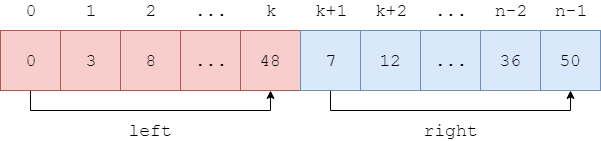

<script type="text/javascript" src="https://cdnjs.cloudflare.com/ajax/libs/mathjax/2.7.1/MathJax.js?config=TeX-AMS-MML_HTMLorMML"></script>

# Merge Sort - 归并排序

--------

#### 问题

用Merge Sort对长度为$$ n $$的无序序列$$ s $$从小到大（升序）排序。

#### 解法

将长度为$$ n $$的序列$$ s = [x_0, x_1, \dots, x_{n-1}] $$分为左右两个部分，$$ left = [x_0, \dots, x_k] $$和$$ right = [x_{k+1}, \dots, x_{n-1}] $$，其中$$ 0 \le k \le n-1 $$。想象$$ left $$和$$ right $$都是已排序的。如图：



将$$ left $$和$$ right $$两个已排序的序列合并即可得到更大的有序序列：

```
function merge(s, k, begin, end):
    let sc[begin...end] = s[begin...end]
    let i = begin, j = k+1, k = begin
    while i <= k and j <= end
        if s[i] < s[j]
            sc[k++] = s[i++]
        else
            sc[k++] = s[j++]
    while i <= k
        sc[k++] = s[i++]
    while j <= end
        sc[k++] = s[j++]
    let s[begin...end] = sc[begin...end]
```

(1) merge函数第1行：$$ left = [x_{begin}, \dots, x_{k}], right = [x_{k+1}, \dots, x_{end}] $$；

(2) merge函数第2行：构造长度与$$ s $$相同的数组$$ sc $$，存储$$ left $$和$$ right $$合并后的结果，该结果最终会复制给$$ s $$。该操作需要的空间规模为$$ T(n) $$；

(3) merge函数第3-12行：将$$ left $$和$$ right $$按序合并，得到有序序列$$ sc $$；

(4) merge函数第13行：将$$ sc $$复制到$$ s $$上；

上述操作如图：


如何得到已排序的$$ left $$和$$ right $$？递归的对$$ left, right $$也应用上述操作即可。直到序列本身的长度小于等于1时，可以直接看作已排序序列，不需要继续递归：

```
function merge_sort(s, begin, end):
    if end <= begin+1
        return
    let mid = (begin + end) / 2
    merge_sort(s, begin, mid)
    merge_sort(s, mid+1, end)
    merge(s, mid, begin, end)
```

(1) merge_sort函数第1行：在序列$$ s = [x_0, \dots, x_{n-1}] $$上调用merge_sort时$$ begin = 0, end = n-1 $$；

(2) merge_sort函数第2-3行：当$$ end \le begin+1 $$时，待排序的序列$$ s = [x_{begin}, x_{end}] $$长度小于等于1，可以看作是已排序的，直接返回；

(3) merge_sort函数第4-7行：将待排序的序列$$ s = [x_{begin}, x_{end}] $$从$$ mid $$分开，分别递归的调用自己进行排序，得到两个已排序的$$ left = [x_{begin}, \dots, x_{mid}], right = [x_{mid+1}, \dots, x_{end}] $$，再将两部分合并即可；

#### 复杂度

设$$ k = end - begin $$，merge函数的输入规模为$$ T(k) $$，合并$$ k $$个元素的时间复杂度为$$ O(k) $$。

merge_sort函数的初始输入规模为$$ T(n) $$，因此调用merge函数的输入规模为$$ T(n) $$，每次递归后输入规模为上一层的$$ T(\frac{n}{2}) $$，可得：

$$
\begin{matrix}
T(n)    & = & 2 \cdot T(\frac{n}{2}) + O(n)                                         &   &   \\
        & = & 2 \cdot T(2 \cdot T(\frac{n}{2^2}) + \frac{n}{2}) + O(n)              & = &   2^2 \cdot T(\frac{n}{2^2}) + 2 \cdot O(n) \\
        & = & 2 \cdot T(2 \cdot T(\frac{n}{2^3}) + \frac{n}{2^2}) + 2 \cdot O(n)    & = &   2^3 \cdot T(\frac{n}{2^3}) + 3 \cdot O(n) \\
        & = & \cdots                                                                &   &
\end{matrix}
$$

假设递归层数为$$ L $$，可得：

$$
T(\frac{n}{2^L}) = 1
$$

即：

$$
L = T(log_2 n) = O(log_2 n)
$$

将$$ L $$代入原始递推公式，可得：

$$
\begin{matrix}
T(n) & = & 2^L \cdot T(\frac{n}{2^L}) + L \cdot O(n)  \\
     & = & O(2^{log_2 n}) + O(log_2 n) \cdot O(n) \\
     & = & O(n) + O(log_2 n) \cdot O(n)  \\
     & = & O(n \cdot log_2 n)
\end{matrix}
$$

该算法的时间复杂度为$$ O(n \cdot log_2 n) $$。因为每次merge函数都会申请规模为$$ T(n) $$的内存，其空间复杂度为$$ O(n) $$。

归并排序适用于数据量超过内存的应用场景。试想硬盘上存储着100GB的数字需要排序，而可使用的内存只有1GB，显然无法将所有数字都放在内存中排序（也可以是分布在100台机器的数据无法存储在1台服务器这样的分布式应用场景）。从硬盘中依次读取1GB数字，对其排序后写回硬盘。反复100次即可得到100个已序的数组；再将两个已序数组进行归并排序，排序后写回硬盘，得到更长的已序数组；之后同理。最终可将100GB的数字在硬盘上排序。

#### 源码

[MergeSort.h](https://github.com/linrongbin16/Way-to-Algorithm/blob/master/src/Sort/MergeSort.h)

[MergeSort.cpp](https://github.com/linrongbin16/Way-to-Algorithm/blob/master/src/Sort/MergeSort.cpp)

#### 测试

[MergeSortTest.cpp](https://github.com/linrongbin16/Way-to-Algorithm/blob/master/src/Sort/MergeSortTest.cpp)
