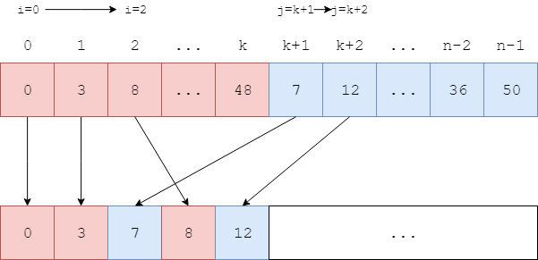

# Merge Sort - 归并排序

--------

#### 问题

用归并排序对长度为$$ n $$的无序序列$$ s $$进行排序。

#### 解法

本问题对无序序列$$ s $$进行升序排序，排序后$$ s $$是从小到大的。

对于长度为$$ n $$的序列$$ s[0,n) $$，将其从中间分开为$$ left[0,k] $$和$$ right[k+1,n-1] $$两个部分（$$ 0 \le k \lt n-1 $$），假设$$ left[0,k] $$和$$ right[k+1,n-1] $$两个部分已经是升序的，那么只需要将这两个部分进行合并排序即可。设$$ i $$和$$ j $$两个下标分别从$$ left $$和$$ right $$的最左边（$$ 0 \le i \le k $$，$$ k+1 \le j \le n-1 $$）向右遍历，每次将$$ left[i] $$和$$ right[j] $$中较小的值插入新的数组中，即可完成一次合并操作。

递归的将$$ left[0,k] $$和$$ right[k+1,n-1] $$分别拆分为更小的$$ left $$和$$ right $$两部分，假定子部分也是升序的，重复上述操作即可得到有序的$$ left[0,k] $$和$$ right[k+1,n-1] $$。这样递归下去，当某个部分的长度等于1时，可以看作长度为1的有序部分，递归结束。

对于长度$$ n $$的序列$$ s $$，每一轮放置所需要的时间为$$ O(n) $$，总共需要$$ log_{2}n $$轮，该算法的时间复杂度为$$ O(n \cdot log_{2}n) $$。

--------

#### 源码

[MergeSort.h](https://github.com/linrongbin16/Way-to-Algorithm/blob/master/src/Sort/MergeSort.h)

[MergeSort.cpp](https://github.com/linrongbin16/Way-to-Algorithm/blob/master/src/Sort/MergeSort.cpp)

#### 测试

[MergeSortTest.cpp](https://github.com/linrongbin16/Way-to-Algorithm/blob/master/src/Sort/MergeSortTest.cpp)
