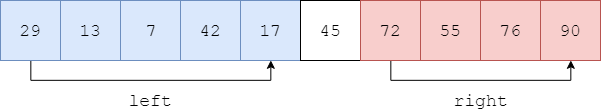

<script type="text/javascript" src="https://cdnjs.cloudflare.com/ajax/libs/mathjax/2.7.1/MathJax.js?config=TeX-AMS-MML_HTMLorMML"></script>

# Quick Sort - 快速排序

--------

#### 问题

用Quick Sort对长度为$$ n $$的无序序列$$ s $$从小到大（升序）排序。

#### 解法

在长度为$$ n $$的序列$$ s = [x_0, x_1, \dots, x_{n-1}] $$选取最左边元素$$ x_0 $$作为$$ pivot $$，然后将剩余部分分为两个部分$$ left = [x_1, \dots, x_k] $$和$$ right = [x_{k+1}, \dots, x_{n-1}] $$（其中$$ 1 \le k \le n-1 $$），满足$$ left $$所有元素都位于$$ pivot $$左边，小于等于$$ pivot $$，$$ right $$所有元素都位于$$ pivot $$右边，大于等于$$ pivot $$，而$$ left, right $$内部并不必须是有序的。如图：



将$$ s = [x_0, \dots, x_{n-1}] $$中任意$$ x \lt pivot $$移动到其左边，任意$$ x \gt pivot $$移动到其右边。需要如下操作：

```
function partition(s, low, high):
    let pivot = s[low]
    while low < high
        while low < high and s[high] >= pivot
            high--
        s[low] = s[high]
        while low < high and s[low] <= pivot
            low++
        s[high] = s[low]
    s[low] = pivot
    return low
```

(1) `partition`函数第2行：令$$ s $$第一个元素$$ s[low] $$作为$$ pivot $$；

(2) `partition`函数第3-9行：轮流从$$ s $$最右边选出第一个$$ x \lt pivot $$移动到其左边，从$$ s $$最左边选出第一个$$ x \gt pivot $$移动到其右边，直到$$ low \ge high $$；

(3) `partition`函数第10-11行：经过移动之后$$ low $$的位置即为最终$$ pivot $$的位置，将该位置返回给函数调用者；

上述操作的示例如图：


设$$ pivot = s[0] = 45, low = 0, high = n-1 $$。从$$ high $$向左搜索第一个$$ s[high] = 29 \lt pivot = 45 $$，令$$ s[low] = s[high] $$。


再从$$ low $$开始向右搜索第一个$$ s[low] = 90 \gt pivot = 45 $$，令$$ s[high] = s[low] $$。


再从$$ high $$向左搜索第一个$$ s[high] = 13 \lt pivot = 45 $$，令$$ s[low] = s[high] $$。

上述操作直到$$ low \ge high $$停止，此时$$ low $$的位置即为$$ pivot $$的位置，令$$ s[low] = pivot $$就完成了本轮操作。

递归的对$$ left $$和$$ right $$进行该操作，即可完成整个数组排序：

```
function quick_sort(s, begin, end):
    if end <= begin+1
        return
    let mid = partition(s, begin, end)
    quick_sort(s, begin, mid)
    quick_sort(s, mid, end)
```

#### 复杂度

设$$ high - low = k $$，则`partition`函数的输入规模为$$ T(k) $$，其时间复杂度为$$ O(k) $$。

`quick_sort`函数的初始输入规模为$$ T(n) $$，调用`partition`的输入规模为$$ T(n) $$，每次递归后输入规模为上一层的$$ T(\frac{n}{2}) $$，可得：

$$
\begin{matrix}
T(n)    & = & 2 \cdot T(\frac{n}{2}) + O(n)
\end{matrix}
$$

类似MergeSort算法，该算法的时间复杂度为$$ O(n \cdot log_2 n) $$，因为所有操作都没有申请额外内存，是在原地完成，因此空间复杂度为$$ O(1) $$。

#### 源码

[QuickSort.h](https://github.com/linrongbin16/Way-to-Algorithm/blob/master/src/Sort/QuickSort.h)

[QuickSort.cpp](https://github.com/linrongbin16/Way-to-Algorithm/blob/master/src/Sort/QuickSort.cpp)

#### 测试

[QuickSortTest.cpp](https://github.com/linrongbin16/Way-to-Algorithm/blob/master/src/Sort/QuickSortTest.cpp)
