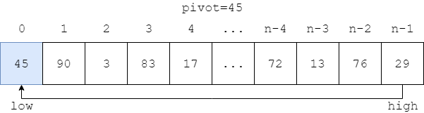
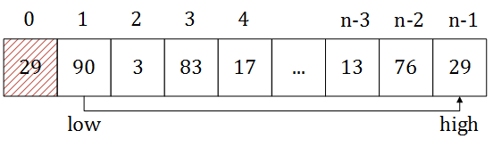
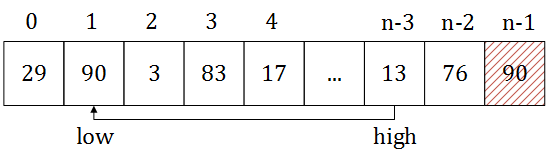

--------
* [Upper Folder - 上一级目录](../)
* [Source Code - 源码](https://github.com/zhaochenyou/Way-to-Algorithm/blob/master/src/Sort/QuickSort.hpp)
* [Test Code - 测试](https://github.com/zhaochenyou/Way-to-Algorithm/blob/master/src/Sort/QuickSort.cpp)

--------

### Quick Sort
### 快速排序

问题：

用快速排序对长度为\(n\)的无序序列\(s\)进行排序。 

解法：

本问题对无序序列\(s\)进行升序排序，排序后\(s\)是从小到大的。 

将长度为\(n\)的序列\(s\)，选取最左边的值作为\(id\)，将剩余部分分为\(left\)和\(right\)两个部分，\(left\)和\(right\)是无序的，且\(left\)中的所有元素\(\forall x \le id\)（其中\(x \in left\)），\(right\)中的所有元素\(\forall y \le id\)（其中\(y \in right\)）。 

初始时\(left\)和\(right\)两个部分都是空的，分别从数组\(s\)的左右两边向中间推进。例如下图中的数组： 

初始时设置\(id = s[0] = 45\)，\(low = 0\)，\(high = n-1\)。从\(high\)开始，向左搜索到第一个元素\(s[high] \lt id\)（\(high = n-1\)），该元素不符合\(right\)的性质，因此将\(s[high]\)移动到\(s[low]\)（\(s[low] = s[high]\)）。 

再从\(low\)开始，向右搜索到第一个元素\(s[low] \gt id\)（\(low = 1\)），该元素不符合\(left\)的性质，因此将\(s[low]\)移动到\(s[high]\)（\(s[high] = s[low]\)）。 

重复上面的操作，直到\(low = high\)，这时的\(low\)和\(high\)的位置即为\(left\)和\(right\)的中间位置，将\(id\)移动到该位置（\(s[low] = id\)），就完成了一轮排序。\(left\)和\(right\)内部仍然是无序的，把它们也当作一个数组，递归的进行排序即可。 

对于长度\(n\)的序列\(s\)，每一轮放置所需要的时间为\(O(n)\)，总共需要\(log_{2} n\)轮，该算法的时间复杂度为\(O(n \cdot log_{2}⁡n)\)。 

--------
--------
