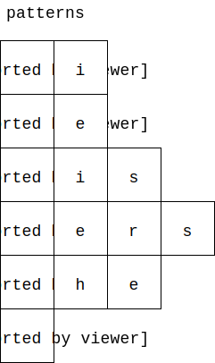
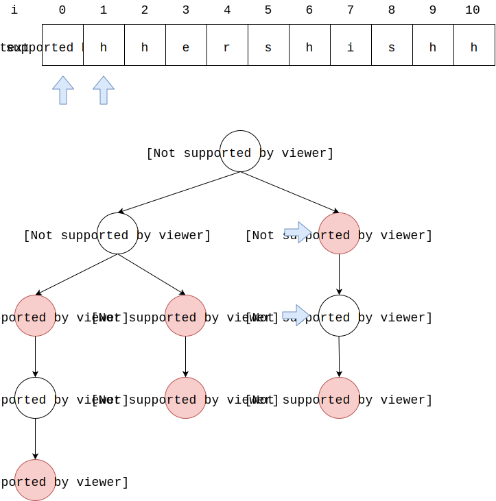
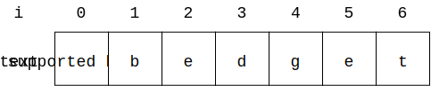
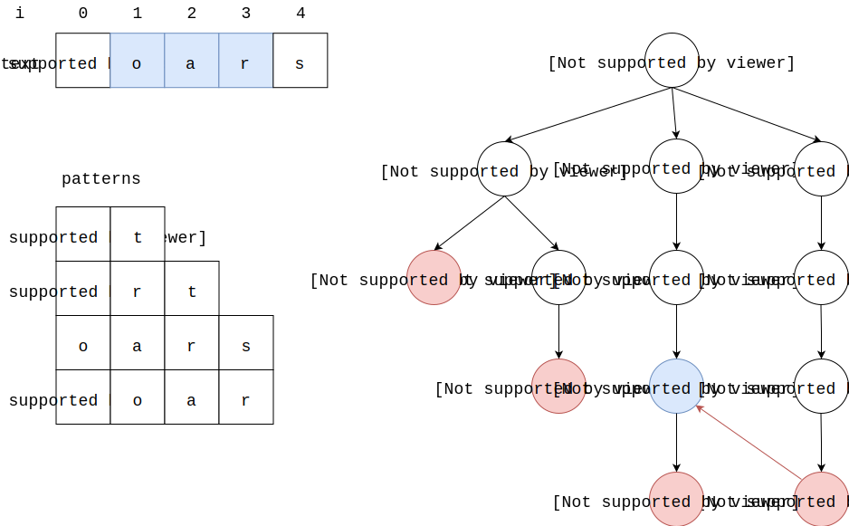
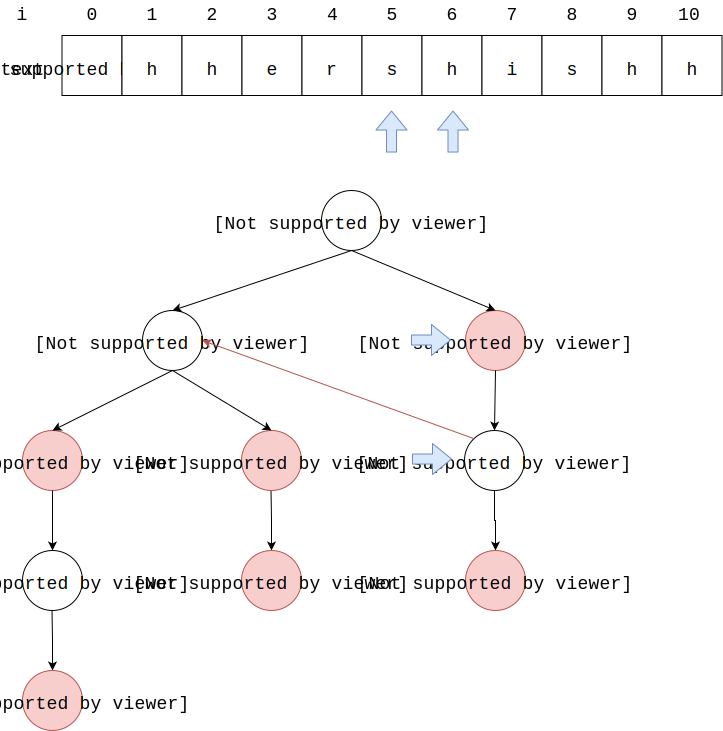
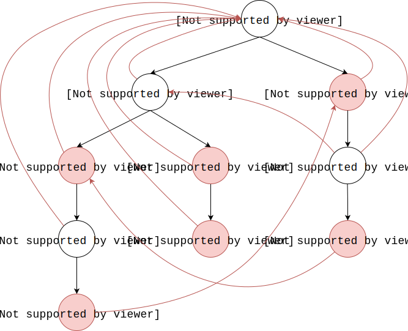
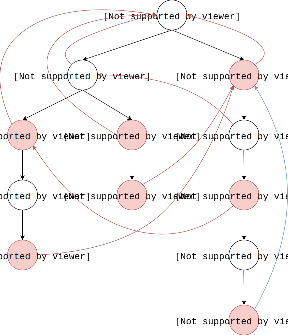

# Aho Corasick Automata - AC自动机

--------

#### 问题

在文本$$ text $$中查找$$ k $$个模式$$ pattern $$出现的所有位置（其中$$ text $$长度为$$ n $$，$$ pattern_{i} $$的长度为$$ m_{i} $$，其中最长的模式长度为$$ m_{max} $$且$$ n \gt m_{max} $$）。

#### 简单字符串匹配算法

假设所有模式的长度之和为$$ \sum_{i=1}^{k} m_{i} $$，将简单字符串匹配SimpleMatch应用在本问题上，搜索所有模式需要重复$$ k $$次。

#### 前缀树

我们能否在一次匹配$$ text $$的过程中就同时找出所有模式呢？即并行算法（算法上的并行，非多线程多进程的并行）。

首先用所有$$ pattern $$构造一个前缀树$$ pt $$，如图所示：

$$ (1) $$ 从$$ text $$的首个字符$$ text[i = 0] $$开始，将其与第一层以$$ pt[0] $$为根节点的孩子节点匹配，可知$$ text[0] = pt[1] $$，然后$$ i = i + 1 $$向右移动一位，$$ pt $$下一次匹配的位置以$$ pt[1] $$为根节点向下匹配；

$$ (2) $$ 从$$ text[i = 1] $$开始，将其与第二层以$$ pt[1] $$为根节点的孩子节点匹配，可知$$ text[1] = pt[5] $$。因$$ pt[5] $$为前缀树的终结点，则$$ "ab" $$在$$ text[0] $$处匹配成功。然后$$ i = i + 1 $$向右移动一位，$$ pt $$下一次匹配的位置是以$$ pt[5] $$为根节点向下匹配；

$$ (3) $$ 从$$ text[i = 2] $$开始，将其与第三层以$$ pt[5] $$为根节点的孩子节点匹配，可知$$ text[2] \ne pt[10] $$匹配失败。然后$$ i = i + 1 $$向右移动一位，$$ pt $$下一次匹配的位置回到根节点，以$$ pt[0] $$为根节点向下匹配；

$$

\cdots

$$

直接应用SimpleMatch算法的时间复杂度为$$ O_{1} = O(n \cdot \sum_{i=1}^{k} m_{i}) $$。构建前缀树的时间复杂度为$$ O(\sum_{i=1}^{k} m_{i}) $$，之后对于文本上每个字符，都匹配一次前缀树即可，该算法的时间复杂度为$$ O_{2} = O(\sum_{i=1}^{k} m_{i}) + O(n \cdot max(m_{i})) $$。当$$ n $$远大于$$ max(m_{i}) $$时显然构造第二种算法更优。

#### 失败指针

考虑优化前缀树，如图所示：

$$ (1) $$ $$ text[0 \dots 3] $$与$$ pt[3 \dots 12] $$这一串完成匹配后，仔细观察可以发现，其实$$ text[1 \dots 4] = pt[2 \dots 11] $$；

$$ (2) $$ 在构造前缀树时我们已知$$ pt[2 \dots 9] = pt[7 \dots 12] $$，$$ pt[2 \dots 9] $$的长度为$$ 3 $$。那么我们可以从前缀树中字符串的末尾字符位置$$ pt[12] $$直接跳到$$ pt[9] $$。这时必然有$$ text[1 \dots 3] = pt[2 \dots 9] $$，继续向右匹配发现$$ text[4] = pt[11] $$，可知$$ text[1 \dots 4] = pt[2 \dots 11] $$。图中红色的连线称为后缀链接$$ suffix link $$，也称失败链接/失败指针$$ failure link $$；

失败指针是从前缀树中$$ pt[i] $$指向$$ pt[j] $$的指向链接，这两个节点分别是字符串$$ \alpha $$和$$ \beta $$的末尾字符，$$ \alpha, \beta $$都是前缀树中的字符串，且$$ \beta $$是$$ \alpha $$的后缀字符串。比如下图中$$ pt[2 \dots 9] = "oar" $$是$$ pt[3 \dots 12] = "soar" $$的后缀。

当我们在前缀树上匹配结束时（成功或失败都是匹配结束），仍然可以验证失败指针找到其他的后缀继续匹配，这时可以跳过之前已经成功匹配的字符，降低时间复杂度。沿着失败指针的跳转可以是多次的，直到再也没有失败指针为止。失败指针的优化可以避免对于$$ text $$上每个字符，都重复搜索整个前缀树，时间复杂度降低到$$ O_{3} = O(\sum_{i=1}^{k} m_{i}) + O(n) $$。

#### 输出指针

失败指针的优化存在一个问题，如图所示：

上图中，从$$ text[0] $$开始匹配，$$ text[0 \dots 4] = pt[3 \dots 10] $$匹配成功，而$$ pt[10] $$上并不存在失败指针，又要从$$ text[1] $$开始重新匹配。经过观察可知，如果将前缀树的匹配位置从$$ pt[9] $$调整到$$ pt[7] $$，那么可以直接得到$$ pt[2 \dots 7] = text[1 \dots 3] $$，从而避免了重新匹配。也可以将匹配位置从$$ pt[8] $$调整到$$ pt[1] $$，可得$$ pt[1 \dots 1] = text[2 \dots 2] $$。显然失败指针并不能优化所有情况，在上图中它的时间复杂度退化回单纯的前缀树的性能。

我们在前缀树上建立输出指针来优化，下图中蓝色线从节点$$ pt[i] $$指向节点$$ pt[j] $$，其中$$ pt[j] $$是前缀树中字符串$$ \beta $$的末尾字符，而$$ pt[i] $$是前缀树中字符串$$ \alpha $$的非末尾字符，且$$ \beta $$是$$ \alpha $$的后缀字符串。当存在输出指针时，可以直接沿着输出指针成功匹配一次。

最终得到Aho Corasick算法：对于文本$$ text $$上的任意字符$$ text[i] $$，从前缀树$$ pt $$的根部开始匹配，当匹配结束时，$$ 1) $$ 若$$ text $$上的一部分与前缀树的某个字符串匹配，则成功匹配；$$ 2) $$ 若成功匹配时，前缀树指针当前的位置上有失败指针，则将位置调整到失败指针，也可以成功匹配一次，然后递归的使用失败指针一直匹配；$$ 3) $$ 若匹配过程中遇到输出指针，则递归的使用所有输出指针成功匹配；

#### 构建AC自动机

构建AC自动机需要三步：$$ 1) $$构建前缀树；$$ 2) $$构建失败指针；$$ 3) $$构建输出指针。

前缀树的构造详见本书的DataStructure-PrefixTree。

--------

#### Aho Corasick Automata

* https://web.stanford.edu/class/cs166/lectures/02/Small02.pdf

--------

#### 源码

[import, lang:"c_cpp"](../../../src/TextMatch/AhoCorasick.h)

#### 测试

[import, lang:"c_cpp"](../../../src/TextMatch/AhoCorasick.cpp)
