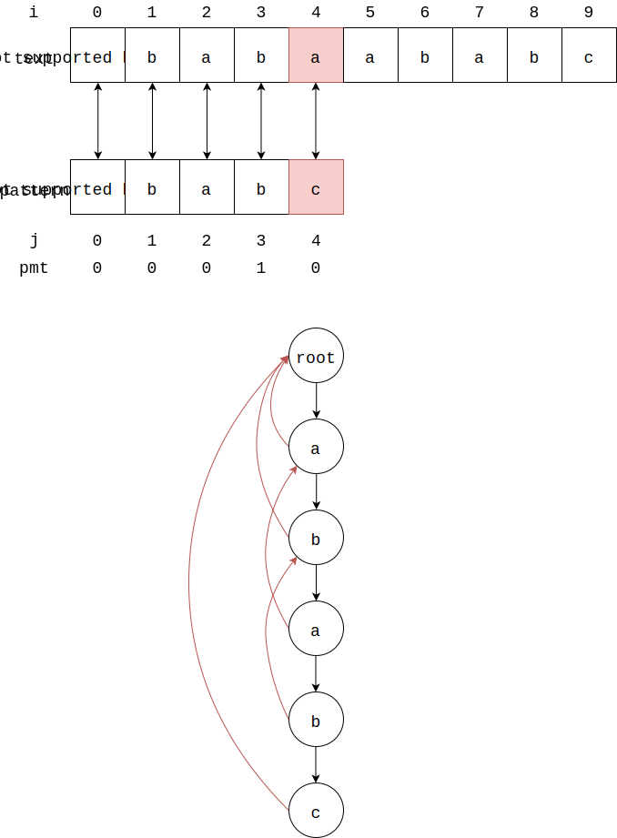

# Knuth Morris Pratt - KMP匹配算法

--------

#### 问题

在文本$$ text $$中查找字符串$$ pattern $$出现的所有位置（$$ text $$长度为$$ n $$，$$ pattern $$长度为$$ m $$，$$ n, m $$都是正整数且$$ n \gt m $$）。

#### 解法

没有学习AC自动机前想要理解KMP算法非常困难，KMP算法可以看作只有一个模式的AC自动机的简化版。所以将KnuthMorrisPratt放在AhoCorasickAutomata之后，请读者在学习KMP算法之前先阅读AhoCorasickAutomata。

将AC自动机应用在只有一个模式的匹配时，我们会发现这样的AC自动机中没有输出指针，只有失败指针。为了简化我们不再使用树形结构体，而用数组下标来表示失败指针：

得到模式$$ pattern $$的每个节点跳转的下标，在KMP算法中，这个跳转的下标数组称为失败函数（Failure Function），或部分匹配表（Partial Match Table）。部分匹配表的实质也是最长后缀字符串。

当匹配到$$ text[0 \dots 3] = pattern[0 \dots 3] $$但$$ text[4] \ne pattern[4] $$时，已知$$ pattern[0 \dots 3] $$的最长后缀字符串为$$ pt[0 \dots 1] $$，按照AC自动机的算法，当前的匹配位置是$$ pattern[3] $$，沿着失败指针$$ pattern[3] \rightarrow pattern[1] $$跳转，然后继续尝试匹配$$ pattern[2] $$和$$ text[4] $$。指向前缀树根节点的下标都设为$$ -1 $$。

由此可得，对于$$ text[i] \ne pattern[j] $$，若$$ j = 0 $$则文本上的位置右移一位$$ i = i + 1 $$，匹配上的位置不动；若$$ j \gt 0 $$则模式上的匹配位置跳转到$$ j - 1 = pmt[j - 1] $$即$$ j = pmt[j - 1] + 1 $$，文本上的位置不动。然后继续尝试匹配$$ text[i] $$和$$ pattern[j] $$。对于$$ text[i] = pattern[j] $$，则文本和模式上的位置都右移一位$$ i = i + 1, j = j + 1 $$。当$$ j $$为模式$$ pattern $$的末尾字符，并且$$ text[i] = pattern[j] $$匹配成功，这时我们仍然将两个位置右移一位$$ i = i + 1, j = j + 1 $$继续匹配，那么显然有$$ text[i] \ne pattern[j] $$（因为模式在这个位置已经没有字符了），这时$$ j $$的跳转位置为$$ j = pmt[j-1] + 1 $$，然后就可以正常匹配了。

根据AC自动机中构造前缀树及失败指针的算法可知：

$$ (1) $$ 对于模式上的位置$$ j = 0 $$（前缀树根节点的第一层孩子节点），其失败指针为$$ pmt[j] = -1 $$；

$$ (2) $$ 对于模式上的位置$$ j \gt 0 $$，其父节点位置为$$ j - 1 $$，父节点的失败指针位置为$$ pmt[j-1] $$，而失败指针的孩子节点的位置必然是$$ pmt[j-1] + 1 $$。若$$ pattern[j] = pattern[pmt[j-1] + 1] $$，则可知失败指针为$$ pmt[j] = pmt[j-1] + 1 $$；否则失败指针为$$ pmt[j] = -1 $$：

即公式：

$$

pmt[j] =
\begin{matrix}
-1       &   j = 0   \\
-1       &   0 \lt j \lt m, pattern[pmt[j-1]+1] \ne pattern[j]   \\
pmt[j-1] + 1 &  0 \lt i \lt m, pattern[pmt[j-1]+1] = pattern[j]
\end{matrix}

$$

实际编程中为了方便操作数组下标，通常会定义数组$$ next $$，令$$ next[i] = pmt[i-1] $$。

KMP算法的时间复杂度为$$ O(n + m) $$。

--------

#### 源码

[import, lang:"c_cpp"](../../../src/TextMatch/KnuthMorrisPratt.h)

#### 测试

[import, lang:"c_cpp"](../../../src/TextMatch/KnuthMorrisPratt.cpp)
