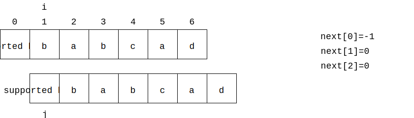
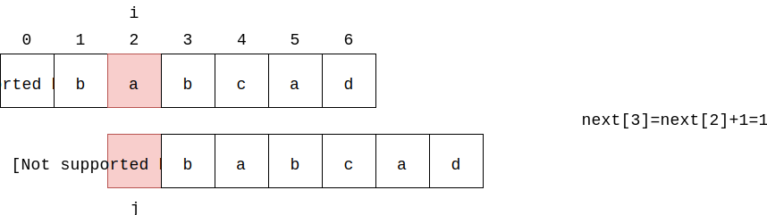
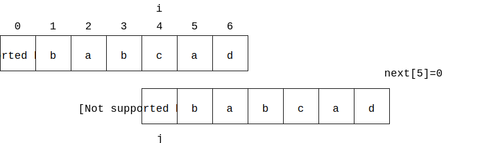
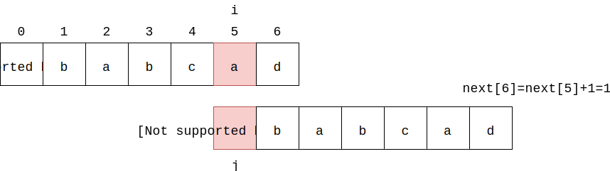

# Knuth Morris Pratt - KMP匹配算法

--------

#### 问题

在文本$$ text $$中查找字符串$$ pattern $$出现的所有位置（$$ text $$长度为$$ n $$，$$ pattern $$长度为$$ m $$，$$ n, m $$都是正整数且$$ n \gt m $$）。

#### 解法

在没有学习AC自动机之前，理解KMP算法非常困难，所以我将KMP算法放在AC自动机之后。把KMP算法看作只有一个模式的AC自动机的简化版。请读者在学习KMP算法之前先阅读AhoCorasickAutomata。

对于下面这个匹配：

$$ (1) $$ 从$$ text[i = 0], pattern[j = 0] $$开始，可以得到$$ text[0 \dots 3] = pattern[0 \dots 3] $$但$$ text[4] \ne pattern[4] $$；

$$ (2) $$ 但这次我们不希望从$$ text[i = 1], pattern[j = 0] $$重新开始。通过观察发现，显然$$ text[1] \ne pattern[0] $$，而真正适合作为下一轮匹配的起始点是$$ text[i = 2], pattern[j = 0] $$，因为$$ pattern[0 \dots 1] = pattern[2 \dots 3] $$，而上一轮匹配失败时$$ text[0 \dots 3] = pattern[0 \dots 3] $$。我们称$$ j = 4 $$这样令匹配失败的位置为“失败位置”；

在介绍KMP算法之前，我们先介绍失败函数（Failure Function）或者称部分匹配表（Partial Match Table）。如图：

上图中字符串$$ pattern = "abababca" $$的前缀包括$$ prefix = ["a", "ab", "aba", "abab", "ababa", "ababab", "abababc"] $$（字符串的前缀不能是它本身，也不能是空字符串），后缀包括$$ suffix = ["bababca", "ababca", "babca", "abca", "bca", "ca", "a"] $$。其中$$ prefix $$称为前缀集合，$$ suffix $$是后缀集合。$$ pmt $$的值即为一个字符串的前缀集合和后缀集合的交集中最长字符串的长度。下面是几个示例：

$$ (1) $$ 字符串$$ pattern = "abababca" $$的$$ prefix $$和$$ suffix $$的交集是$$ ["a"] $$，其中最长字符串的长度为$$ 1 $$。

$$ (2) $$ 字符串$$ pattern = "ababa" $$的$$ prefix = ["a", "ab", "aba", "abab"] $$和$$ suffix = ["baba", "aba", "ba", "a"] $$的交集是$$ ["a", "aba"] $$，其中最长字符串的长度为$$ 3 $$。

$$ (3) $$ 字符串$$ pattern = "ab" $$的$$ prefix = ["a"] $$和$$ suffix = ["b"] $$的交集是$$ \emptyset $$，其中最长字符串的长度为$$ 0 $$。

有了部分匹配表，我们回到图2中的例子，可以算出$$ pattern $$的$$ pmt $$：

当$$ text[0 \dots 3] = pattern[0 \dots 3] $$但$$ text[4] = pattern[4] $$，我们可以发现$$ pattern[0 \dots 1] = pattern[2 \dots 3] $$，即字符串$$ pattern[0 \dots 3] = "abab" $$的前缀集合$$ prefix = ["a", "ab", "aba"] $$和后缀集合$$ suffix = ["bab", "ab", "b"] $$的交集为$$ ["ab"] $$，其中最长的交集字符串$$ "ab" $$的长度为$$ 2 $$。

那么这里我们可以跳过$$ pattern[0 \dots 1] $$这$$ 2 $$个字符，下一次开始匹配的位置为$$ text[i = 4], pattern[j = 2] $$。

到此，我们通过部分匹配表完成了一次匹配失败时的跳跃。当我们匹配$$ text[i \dots i+m-1] $$和$$ pattern[0 \dots m-1] $$时，遇到前$$ k $$个字符成功匹配$$ text[i \dots i+k] = pattern[0 \dots k] $$，而第$$ k + 1 $$处不匹配$$ text[i+k+1] \ne pattern[k+1] $$，称$$ fail = k + 1 $$为失败位置。查看字符串$$ pattern[fail - 1] $$处部分匹配表$$ pmt[fail - 1] $$的值，就可以确定出下次重新开始匹配时的位置为$$ i = i + pmt[fail - 1], j = pmt[fail - 1] $$。

为了方便我们将整个$$ pmt $$表向右移动一位，得到$$ next $$数组（$$ next[0] = -1 $$）。这样当$$ text[i] \ne pattern[j] $$匹配失败时，可以直接查找$$ next[fail] $$知道下次开始匹配的位置为$$ i = i + next[fail], j = next[fail] $$。额外注意$$ 0 \gt fail \ge m $$，若第一个字符$$ text[i] \ne pattern[j = 0] $$就不匹配，则将$$ j $$向右移动一位设置为$$ j = 0 $$后重新开始。

让两个$$ pattern $$从$$ i = 1 $$开始自己相互匹配，初始时$$ next[0] = -1 $$，在任意位置$$ i $$处，若匹配则在该位置$$ next[i+1] = next[i] + 1 $$，然后将下标$$ i, j $$都向右移动一位，即$$ i = i + 1, j = j + 1 $$。若不匹配则在该位置$$ next[i+1] = 0 $$，然后将下标$$ i $$向右移动一位即$$ i = i + 1 $$，$$ j $$重置为$$ 0 $$。

KMP算法确实是一种精巧设计的算法，在这之外还有AC自动机、确定性有限状态自动机（Deterministic Finite State Automaton，简称DFA）等更高级的文本识别技术来解决字符串匹配问题。

--------

KMP算法

* https://www.zhihu.com/question/21923021/answer/281346746

--------

#### 源码

[import, lang:"c_cpp"](../../../src/TextMatch/KnuthMorrisPratt.h)

#### 测试

[import, lang:"c_cpp"](../../../src/TextMatch/KnuthMorrisPratt.cpp)
