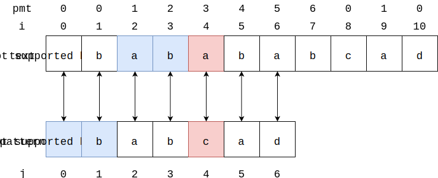
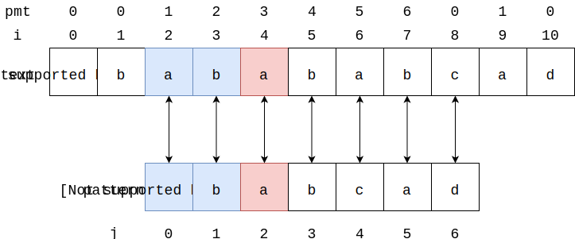
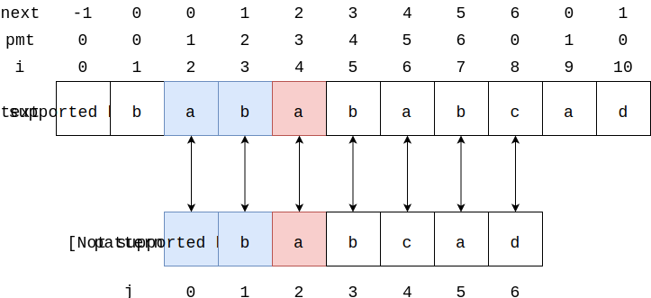

# Knuth Morris Pratt - KMP匹配算法

--------

#### 问题

在文本$$ text $$中查找字符串$$ pattern $$出现的所有位置（$$ text $$长度为n，$$ pattern $$长度为$$ m $$，$$ n, m $$都是正整数且$$ n \gt m $$）。

#### 解法

KMP算法的性能为$$ O(n) $$，比SimpleMatch高很多。在$$ text $$中匹配$$ pattern $$的过程中，仔细观察可以发现，不必在失败时从$$ pattern $$的起始重新匹配，我们可以对这块进行优化。

对于下面这个匹配：

$$ (1) $$ 从$$ text[i = 0], pattern[j = 0] $$开始，可以得到$$ text[0 \dots 3] = pattern[0 \dots 3] $$但$$ text[4] \ne pattern[4] $$；

$$ (2) $$ 但这次我们不希望从$$ text[i = 1], pattern[j = 0] $$重新开始。通过观察发现，显然$$ text[1] \ne pattern[0] $$，而真正适合作为下一轮匹配的起始点是$$ text[i = 2], pattern[j = 0] $$，因为$$ text[0 \dots 1] = text[2 \dots 3] $$，而上一轮匹配失败时$$ text[0 \dots 3] = pattern[0 \dots 3] $$。我们称$$ i = 4 $$这样令匹配失败的位置为“失败位置”；

在介绍KMP算法之前，我们先介绍失败函数（Failure Function）或者称部分匹配表（Partial Match Table）。如图：

上图中字符串$$ text = "abababca" $$的前缀包括$$ prefix = ["a", "ab", "aba", "abab", "ababa", "ababab", "abababc"] $$（字符串的前缀不能是它本身，也不能是空字符串），后缀包括$$ suffix = ["bababca", "ababca", "babca", "abca", "bca", "ca", "a"] $$。其中$$ prefix $$称为前缀集合，$$ suffix $$是后缀集合。$$ pmt $$的值即为一个字符串的前缀集合和后缀集合的交集中最长字符串的长度。下面是几个示例：

$$ (1) $$ 字符串$$ text = "abababca" $$的$$ prefix $$和$$ suffix $$的交集是$$ ["a"] $$，其中最长字符串的长度为$$ 1 $$。

$$ (2) $$ 字符串$$ text = "ababa" $$的$$ prefix = ["a", "ab", "aba", "abab"] $$和$$ suffix = ["baba", "aba", "ba", "a"] $$的交集是$$ ["a", "aba"] $$，其中最长字符串的长度为$$ 3 $$。

$$ (3) $$ 字符串$$ text = "ab" $$的$$ prefix = ["a"] $$和$$ suffix = ["b"] $$的交集是$$ \emptyset $$，其中最长字符串的长度为$$ 0 $$。

有了部分匹配表，我们回到图2中的例子，可以算出$$ text $$的$$ pmt $$：

当$$ text[0 \dots 3] = pattern[0 \dots 3] $$但$$ text[4] = pattern[4] $$，我们可以发现$$ text[0 \dots 1] = text[2 \dots 3] $$，即字符串$$ text[0 \dots 3] = "abab" $$的前缀集合$$ prefix = ["a", "ab", "aba"] $$和后缀集合$$ suffix = ["bab", "ab", "b"] $$的交集为$$ ["ab"] $$，其中最长的交集字符串$$ "ab" $$的长度为$$ 2 $$。

那么这里我们可以跳过$$ 2 $$个字符，下一次开始匹配的位置为$$ i = 2, j = 0 $$。

到此，我们通过部分匹配表完成了一次匹配失败时的跳跃。当我们匹配$$ text[i \dots i+j] $$和$$ pattern[0 \dots j] $$时，遇到前$$ k $$个字符成功匹配$$ text[i \dots i+k] = pattern[0 \dots k] $$，而第$$ k + 1 $$处不匹配$$ text[i+k+1] = pattern[k+1] $$时，查看字符串$$ text[0 \dots i+k] $$处部分匹配表$$ pmt[i+k] $$的值，就可以确定出下次重新开始匹配时，需要跳过的字符数量。

因为$$ i+k+1 $$即为失败位置$$ fail $$，可知这时需要查找的部分匹配表$$ pmt[fail-1] $$处的值，为了方便我们将整个$$ pmt $$右移一位，得到$$ next $$数组。这样当$$ text $$上某个位置$$ i = fail $$匹配失败时，可以直接查找$$ next[fail] $$知道下次开始匹配的位置为$$ fail + next[fail] $$

上一段中的$$ k $$为正整数且满足$$ 0 \gt k \gt fail, 0 \gt fail - k \gt fail  $$。这个函数

$$

k = f(fail)

$$

称作失败函数（Failure Function）、部分匹配表（Partial Match Table）。在字符串$$ pattern[0 \dots m-1] $$上由任意位置$$ j $$组成的前缀字符串$$ pattern[0 \dots j] $$，求出一个最大的$$ k $$使其满足$$ pattern[0 \dots k] = pattern[j-k \dots j] $$。

那么当$$ pattern $$在$$ text[i] $$上匹配失败时，设$$ text[i \dots i+fail-1] = pattern[0 \dots fail-1] $$但$$ text[i+fail] \ne pattern[fail] $$，求出一个$$ k $$可以直接让$$ i = i + k + 1 $$，找到下一次匹配的起始位置。

KMP算法需要对$$ pattern $$进行预处理，来算出每个位置$$ j $$对应的$$ k $$值，实际匹配时可以直接查找。一种简单的构造方法是在长度为$$ m $$的$$ pattern $$上遍历，若$$ pattern[k] = pattern[fail - k] $$（$$ 0 \gt k \gt fail $$）则$$ k $$向右移动，否则即为所求，但该方法的时间复杂度为$$ O(m ^ 2) $$。

介绍一种时间复杂度为$$ O(m) $$的构造$$ pattern $$每个位置上的$$ k $$值的办法。如图所示：

显然由于$$ 0 \gt k \gt fail $$，当$$ f(0), f(1) $$并不存在，一般令$$ f(0) = -1, f(1) = 0 $$。对于$$ fail = 2 $$，若

KMP算法是一种精巧设计的算法，但实际上字符串匹配问题是文法识别问题，可以用确定性有限状态自动机（Deterministic Finite State Automaton，简称DFA）来解决。

--------

KMP算法

* https://www.zhihu.com/question/21923021/answer/281346746

--------

#### 源码

[import, lang:"c_cpp"](../../../src/TextMatch/KnuthMorrisPratt.h)

#### 测试

[import, lang:"c_cpp"](../../../src/TextMatch/KnuthMorrisPratt.cpp)

times in msec
 clock   self+sourced   self:  sourced script
 clock   elapsed:              other lines

000.000  000.000: --- VIM STARTING ---
000.000  000.000: Allocated generic buffers
002.000  002.000: locale set
007.000  005.000: GUI prepared
007.000  000.000: clipboard setup
007.000  000.000: window checked
008.000  001.000: inits 1
009.000  001.000: parsing arguments
009.000  000.000: expanding arguments
010.000  001.000: shell init
010.000  000.000: inits 2
010.000  000.000: init highlight
013.000  002.000  002.000: sourcing C:\Users\linrongbin/.vim/autoload/plug.vim
014.000  001.000  001.000: sourcing C:\Users\linrongbin\.vim\autoload\plug.vim
016.000  000.000  000.000: sourcing C:\Users\linrongbin\.vim\plugged\vimfiler.vim\plugin\vimfiler.vim
049.000  000.000  000.000: sourcing C:\Users\linrongbin\.vim\plugged\vim-go\ftdetect\gofiletype.vim
051.000  000.000  000.000: sourcing C:\Users\linrongbin\.vim\plugged\rust.vim\ftdetect\rust.vim
053.000  000.000  000.000: sourcing C:\Users\linrongbin\.vim\plugged\vim-scala\ftdetect\scala.vim
064.000  000.000  000.000: sourcing C:\Users\linrongbin\.vim\plugged\ultisnips\ftdetect\snippets.vim
065.000  000.000  000.000: sourcing C:\Users\linrongbin\.vim\plugged\vim-fugitive\ftdetect\fugitive.vim
066.000  000.000  000.000: sourcing C:\Users\linrongbin\.vim\plugged\vim-json\ftdetect\json.vim
066.000  000.000  000.000: sourcing C:\Users\linrongbin\.vim\plugged\vim-less\ftdetect\less.vim
067.000  000.000  000.000: sourcing C:\Users\linrongbin\.vim\plugged\vim-javascript\ftdetect\javascript.vim
068.000  000.000  000.000: sourcing C:\Users\linrongbin\.vim\plugged\vim-javascript-syntax\ftdetect\javascript.vim
068.000  000.000  000.000: sourcing C:\Users\linrongbin\.vim\plugged\vim-jsx\ftdetect\javascript.vim
069.000  000.000  000.000: sourcing C:\Users\linrongbin\.vim\plugged\thrift.vim\ftdetect\thrift.vim
069.000  000.000  000.000: sourcing C:\Users\linrongbin\.vim\plugged\haskell-vim\ftdetect\haskell.vim
070.000  000.000  000.000: sourcing C:\Users\linrongbin\.vim\plugged\vim-ruby\ftdetect\ruby.vim
071.000  001.000  001.000: sourcing C:\Users\linrongbin\.vim\plugged\vim-ruby\ftdetect\ruby_extra.vim
071.000  000.000  000.000: sourcing C:\Users\linrongbin\.vim\plugged\vim-markdown\ftdetect\markdown.vim
074.000  001.000  001.000: sourcing C:\software\vim8\lang/menu_chinese_gb.936.vim
074.000  001.000  000.000: sourcing C:\software\vim8\lang\menu_zh_cn.cp936.vim
076.000  000.000  000.000: sourcing C:\software\vim8\autoload\paste.vim
085.000  013.000  012.000: sourcing C:\software\vim8/menu.vim
085.000  028.000  014.000: sourcing C:\software\vim8\filetype.vim
086.000  000.000  000.000: sourcing C:\software\vim8\ftplugin.vim
087.000  000.000  000.000: sourcing C:\software\vim8\indent.vim
092.000  002.000  002.000: sourcing C:\software\vim8\syntax\syncolor.vim
092.000  003.000  001.000: sourcing C:\software\vim8\syntax\synload.vim
092.000  005.000  002.000: sourcing C:\software\vim8\syntax\syntax.vim
092.000  081.000  045.000: sourcing C:\Users\linrongbin/.vim/settings/vim-plug.vim
092.000  000.000  000.000: sourcing C:\Users\linrongbin/.vim/settings/DoxygenToolkit.vim
093.000  000.000  000.000: sourcing C:\Users\linrongbin/.vim/settings/ag.vim
095.000  001.000  001.000: sourcing C:\software\vim8\ftoff.vim
103.000  000.000  000.000: sourcing C:\Users\linrongbin\.vim\plugged\ultisnips\ftdetect\snippets.vim
104.000  000.000  000.000: sourcing C:\Users\linrongbin\.vim\plugged\vim-fugitive\ftdetect\fugitive.vim
104.000  000.000  000.000: sourcing C:\Users\linrongbin\.vim\plugged\vim-json\ftdetect\json.vim
105.000  000.000  000.000: sourcing C:\Users\linrongbin\.vim\plugged\vim-less\ftdetect\less.vim
106.000  001.000  001.000: sourcing C:\Users\linrongbin\.vim\plugged\vim-javascript\ftdetect\javascript.vim
106.000  000.000  000.000: sourcing C:\Users\linrongbin\.vim\plugged\vim-javascript-syntax\ftdetect\javascript.vim
107.000  000.000  000.000: sourcing C:\Users\linrongbin\.vim\plugged\vim-jsx\ftdetect\javascript.vim
107.000  000.000  000.000: sourcing C:\Users\linrongbin\.vim\plugged\thrift.vim\ftdetect\thrift.vim
108.000  000.000  000.000: sourcing C:\Users\linrongbin\.vim\plugged\haskell-vim\ftdetect\haskell.vim
108.000  000.000  000.000: sourcing C:\Users\linrongbin\.vim\plugged\vim-ruby\ftdetect\ruby.vim
109.000  000.000  000.000: sourcing C:\Users\linrongbin\.vim\plugged\vim-ruby\ftdetect\ruby_extra.vim
109.000  000.000  000.000: sourcing C:\Users\linrongbin\.vim\plugged\vim-markdown\ftdetect\markdown.vim
110.000  014.000  013.000: sourcing C:\software\vim8\filetype.vim
111.000  000.000  000.000: sourcing C:\software\vim8\ftplugin.vim
111.000  018.000  003.000: sourcing C:\Users\linrongbin/.vim/settings/ale.vim
112.000  000.000  000.000: sourcing C:\software\vim8\syntax/nosyntax.vim
115.000  000.000  000.000: sourcing C:\software\vim8\syntax\syncolor.vim
115.000  002.000  002.000: sourcing C:\software\vim8\syntax\synload.vim
115.000  003.000  001.000: sourcing C:\software\vim8\syntax\syntax.vim
117.000  001.000  001.000: sourcing C:\software\vim8\syntax\syncolor.vim
131.000  000.000  000.000: sourcing C:\software\vim8\syntax\syncolor.vim
134.000  000.000  000.000: sourcing C:\software\vim8\syntax\syncolor.vim
137.000  000.000  000.000: sourcing C:\software\vim8\syntax\syncolor.vim
140.000  022.000  022.000: sourcing C:\Users\linrongbin\.vim\plugged\subtle_solo\colors\subtle_dark.vim
140.000  028.000  002.000: sourcing C:\Users\linrongbin/.vim/settings/color_scheme.vim
141.000  000.000  000.000: sourcing C:\Users\linrongbin/.vim/settings/close_hidden_buffer.vim
141.000  000.000  000.000: sourcing C:\Users\linrongbin/.vim/settings/ctags.vim
142.000  000.000  000.000: sourcing C:\Users\linrongbin/.vim/settings/emmet.vim
142.000  000.000  000.000: sourcing C:\Users\linrongbin/.vim/settings/haskell-vim.vim
143.000  000.000  000.000: sourcing C:\Users\linrongbin/.vim/settings/indentline.vim
144.000  000.000  000.000: sourcing C:\Users\linrongbin/.vim/settings/youcompleteme.vim
144.000  000.000  000.000: sourcing C:\Users\linrongbin/.vim/settings/python-syntax.vim
145.000  000.000  000.000: sourcing C:\Users\linrongbin/.vim/settings/ultisnips.vim
146.000  001.000  001.000: sourcing C:\Users\linrongbin/.vim/settings/vim-airline.vim
146.000  000.000  000.000: sourcing C:\Users\linrongbin/.vim/settings/vim-easymotion.vim
147.000  000.000  000.000: sourcing C:\Users\linrongbin/.vim/settings/vim-gitgutter.vim
147.000  000.000  000.000: sourcing C:\Users\linrongbin/.vim/settings/vim-go.vim
149.000  000.000  000.000: sourcing C:\Users\linrongbin\.vim\plugged\vimfiler.vim\autoload\vimfiler\custom.vim
149.000  001.000  001.000: sourcing C:\Users\linrongbin/.vim/settings/vimfiler.vim
150.000  000.000  000.000: sourcing C:\Users\linrongbin/.vim/settings/yank.vim
150.000  000.000  000.000: sourcing C:\Users\linrongbin/.vim/settings/vim-jsbeautify.vim
151.000  000.000  000.000: sourcing C:\Users\linrongbin/.vim/settings/supertab.vim
152.000  001.000  001.000: sourcing C:\Users\linrongbin/.vim/settings/vim-gutentags.vim
152.000  000.000  000.000: sourcing C:\Users\linrongbin/.vim/settings/vim-autoformat.vim
153.000  000.000  000.000: sourcing C:\Users\linrongbin/.vim/settings/vim-ctrlp.vim
153.000  000.000  000.000: sourcing C:\Users\linrongbin/.vim/settings/vim-markdown.vim
155.000  000.000  000.000: sourcing C:\software\vim8/mswin.vim
156.000  000.000  000.000: sourcing C:\software\vim8/mswin.vim
157.000  000.000  000.000: sourcing C:\software\vim8/delmenu.vim
160.000  000.000  000.000: sourcing C:\software\vim8\lang\menu_zh_cn.utf-8.vim
170.000  012.000  012.000: sourcing C:\software\vim8/menu.vim
172.000  000.000  000.000: sourcing C:\software\vim8\filetype.vim
173.000  000.000  000.000: sourcing C:\software\vim8\filetype.vim
174.000  000.000  000.000: sourcing C:\software\vim8\ftplugin.vim
175.000  000.000  000.000: sourcing C:\software\vim8\filetype.vim
177.000  001.000  001.000: sourcing C:\software\vim8\indent.vim
177.000  000.000  000.000: sourcing C:\software\vim8\syntax/nosyntax.vim
181.000  000.000  000.000: sourcing C:\software\vim8\syntax\syncolor.vim
182.000  000.000  000.000: sourcing C:\software\vim8\syntax\syncolor.vim
184.000  005.000  005.000: sourcing C:\Users\linrongbin\.vim\plugged\subtle_solo\colors\subtle_dark.vim
184.000  006.000  001.000: sourcing C:\software\vim8\syntax\synload.vim
184.000  007.000  001.000: sourcing C:\software\vim8\syntax\syntax.vim
185.000  000.000  000.000: sourcing C:\software\vim8\syntax/nosyntax.vim
188.000  000.000  000.000: sourcing C:\software\vim8\syntax\syncolor.vim
190.000  000.000  000.000: sourcing C:\software\vim8\syntax\syncolor.vim
192.000  005.000  005.000: sourcing C:\Users\linrongbin\.vim\plugged\subtle_solo\colors\subtle_dark.vim
192.000  006.000  001.000: sourcing C:\software\vim8\syntax\synload.vim
192.000  008.000  002.000: sourcing C:\software\vim8\syntax\syntax.vim
192.000  038.000  010.000: sourcing C:\Users\linrongbin/.vim/settings/basic.vim
192.000  181.000  013.000: sourcing $HOME\_vimrc
192.000  001.000: sourcing vimrc file(s)
194.000  000.000  000.000: sourcing C:\Users\linrongbin\.vim\plugged\tabular\plugin\Tabular.vim
195.000  001.000  001.000: sourcing C:\Users\linrongbin\.vim\plugged\vim-gutentags\plugin\gutentags.vim
197.000  000.000  000.000: sourcing C:\Users\linrongbin\.vim\plugged\unite.vim\autoload\unite\custom.vim
197.000  001.000  001.000: sourcing C:\Users\linrongbin\.vim\plugged\unite.vim\plugin\unite\bookmark.vim
198.000  001.000  001.000: sourcing C:\Users\linrongbin\.vim\plugged\unite.vim\plugin\unite\buffer.vim
198.000  000.000  000.000: sourcing C:\Users\linrongbin\.vim\plugged\unite.vim\plugin\unite\window.vim
199.000  001.000  001.000: sourcing C:\Users\linrongbin\.vim\plugged\unite.vim\plugin\unite.vim
199.000  000.000  000.000: sourcing C:\Users\linrongbin\.vim\plugged\vimfiler.vim\plugin\vimfiler.vim
201.000  000.000  000.000: sourcing C:\Users\linrongbin\.vim\plugged\vim-airline\autoload\airline\init.vim
202.000  000.000  000.000: sourcing C:\Users\linrongbin\.vim\plugged\vim-airline\autoload\airline\parts.vim
203.000  003.000  003.000: sourcing C:\Users\linrongbin\.vim\plugged\vim-airline\plugin\airline.vim
203.000  000.000  000.000: sourcing C:\Users\linrongbin\.vim\plugged\vim-airline-themes\plugin\airline-themes.vim
204.000  000.000  000.000: sourcing C:\Users\linrongbin\.vim\plugged\neodark.vim\plugin\neodark.vim
206.000  000.000  000.000: sourcing C:\Users\linrongbin\.vim\plugged\vim-autoformat\plugin\autoformat.vim
208.000  002.000  002.000: sourcing C:\Users\linrongbin\.vim\plugged\vim-autoformat\plugin\defaults.vim
209.000  000.000  000.000: sourcing C:\Users\linrongbin\.vim\plugged\vim-autoformat\plugin\utils.vim
210.000  001.000  001.000: sourcing C:\Users\linrongbin\.vim\plugged\supertab\plugin\supertab.vim
213.000  002.000  002.000: sourcing C:\Users\linrongbin\.vim\plugged\YouCompleteMe\plugin\youcompleteme.vim
215.000  000.000  000.000: sourcing C:\Users\linrongbin\.vim\plugged\ultisnips\autoload\UltiSnips\map_keys.vim
215.000  002.000  002.000: sourcing C:\Users\linrongbin\.vim\plugged\ultisnips\plugin\UltiSnips.vim
216.000  000.000  000.000: sourcing C:\Users\linrongbin\.vim\plugged\vim-snippets\plugin\vimsnippets.vim
218.000  000.000  000.000: sourcing C:\Users\linrongbin\.vim\plugged\ctrlp.vim\autoload\ctrlp\mrufiles.vim
218.000  002.000  002.000: sourcing C:\Users\linrongbin\.vim\plugged\ctrlp.vim\plugin\ctrlp.vim
219.000  000.000  000.000: sourcing C:\Users\linrongbin\.vim\plugged\ag.vim\plugin\ag.vim
220.000  000.000  000.000: sourcing C:\Users\linrongbin\.vim\plugged\Mark--Karkat\plugin\mark.vim
222.000  001.000  001.000: sourcing C:\Users\linrongbin\.vim\plugged\vim-surround\plugin\surround.vim
229.000  007.000  007.000: sourcing C:\Users\linrongbin\.vim\plugged\vim-easymotion\plugin\EasyMotion.vim
230.000  001.000  001.000: sourcing C:\Users\linrongbin\.vim\plugged\vim-multiple-cursors\plugin\multiple_cursors.vim
237.000  007.000  007.000: sourcing C:\Users\linrongbin\.vim\plugged\nerdcommenter\plugin\NERD_commenter.vim
239.000  001.000  001.000: sourcing C:\Users\linrongbin\.vim\plugged\DoxygenToolkit.vim\plugin\DoxygenToolkit.vim
240.000  001.000  001.000: sourcing C:\Users\linrongbin\.vim\plugged\vim-fugitive\plugin\fugitive.vim
242.000  000.000  000.000: sourcing C:\Users\linrongbin\.vim\plugged\vim-gitgutter\autoload\gitgutter\utility.vim
245.000  000.000  000.000: sourcing C:\Users\linrongbin\.vim\plugged\vim-gitgutter\autoload\gitgutter\highlight.vim
247.000  000.000  000.000: sourcing C:\Users\linrongbin\.vim\plugged\vim-gitgutter\autoload\gitgutter\async.vim
248.000  008.000  008.000: sourcing C:\Users\linrongbin\.vim\plugged\vim-gitgutter\plugin\gitgutter.vim
250.000  001.000  001.000: sourcing C:\software\vim8\plugin\getscriptPlugin.vim
250.000  000.000  000.000: sourcing C:\software\vim8\plugin\gzip.vim
251.000  001.000  001.000: sourcing C:\software\vim8\plugin\logiPat.vim
251.000  000.000  000.000: sourcing C:\software\vim8\plugin\manpager.vim
252.000  001.000  001.000: sourcing C:\software\vim8\plugin\matchparen.vim
253.000  001.000  001.000: sourcing C:\software\vim8\plugin\netrwPlugin.vim
253.000  000.000  000.000: sourcing C:\software\vim8\plugin\rrhelper.vim
254.000  001.000  001.000: sourcing C:\software\vim8\plugin\spellfile.vim
254.000  000.000  000.000: sourcing C:\software\vim8\plugin\tarPlugin.vim
255.000  001.000  001.000: sourcing C:\software\vim8\plugin\tohtml.vim
255.000  000.000  000.000: sourcing C:\software\vim8\plugin\vimballPlugin.vim
256.000  001.000  001.000: sourcing C:\software\vim8\plugin\zipPlugin.vim
259.000  000.000  000.000: sourcing C:\Users\linrongbin\.vim\plugged\ale\autoload\ale\balloon.vim
261.000  000.000  000.000: sourcing C:\Users\linrongbin\.vim\plugged\ale\autoload\ale\events.vim
261.000  004.000  004.000: sourcing C:\Users\linrongbin\.vim\plugged\ale\plugin\ale.vim
261.000  016.000: loading plugins
261.000  000.000: loading packages
263.000  000.000  000.000: sourcing C:\Users\linrongbin\.vim\plugged\tabular\autoload\tabular.vim
265.000  003.000  003.000: sourcing C:\Users\linrongbin\.vim\plugged\tabular\after\plugin\TabularMaps.vim
267.000  001.000  001.000: sourcing C:\Users\linrongbin\.vim\plugged\indentLine\after\plugin\indentLine.vim
268.000  000.000  000.000: sourcing C:\Users\linrongbin\.vim\plugged\dracula\autoload\dracula.vim
268.000  001.000  001.000: sourcing C:\Users\linrongbin\.vim\plugged\dracula\after\plugin\dracula.vim
269.000  000.000  000.000: sourcing C:\Users\linrongbin\.vim\plugged\ultisnips\after\plugin\UltiSnips_after.vim
270.000  004.000: loading after plugins
270.000  000.000: inits 3
271.000  001.000  001.000: sourcing $VIMRUNTIME\menu.vim
337.000  019.000  019.000: sourcing C:\Users\linrongbin\.vim\plugged\vim-airline\autoload\airline\extensions.vim
338.000  001.000  001.000: sourcing C:\Users\linrongbin\.vim\plugged\vim-airline\autoload\airline\extensions\quickfix.vim
338.000  000.000  000.000: sourcing C:\Users\linrongbin\.vim\plugged\vim-airline\autoload\airline.vim
339.000  000.000  000.000: sourcing C:\Users\linrongbin\.vim\plugged\vim-airline\autoload\airline\extensions\unite.vim
340.000  000.000  000.000: sourcing C:\Users\linrongbin\.vim\plugged\vim-airline\autoload\airline\extensions\netrw.vim
342.000  000.000  000.000: sourcing C:\Users\linrongbin\.vim\plugged\vim-airline\autoload\airline\extensions\term.vim
343.000  000.000  000.000: sourcing C:\Users\linrongbin\.vim\plugged\vim-airline\autoload\airline\extensions\ctrlp.vim
344.000  000.000  000.000: sourcing C:\Users\linrongbin\.vim\plugged\vim-airline\autoload\airline\extensions\hunks.vim
345.000  001.000  001.000: sourcing C:\Users\linrongbin\.vim\plugged\vim-airline\autoload\airline\util.vim
346.000  001.000  001.000: sourcing C:\Users\linrongbin\.vim\plugged\vim-airline\autoload\airline\extensions\branch.vim
347.000  001.000  001.000: sourcing C:\Users\linrongbin\.vim\plugged\vim-airline\autoload\airline\extensions\fugitiveline.vim
348.000  001.000  001.000: sourcing C:\Users\linrongbin\.vim\plugged\vim-airline\autoload\airline\extensions\ale.vim
349.000  001.000  001.000: sourcing C:\Users\linrongbin\.vim\plugged\vim-airline\autoload\airline\extensions\whitespace.vim
350.000  000.000  000.000: sourcing C:\Users\linrongbin\.vim\plugged\vim-airline\autoload\airline\extensions\po.vim
351.000  000.000  000.000: sourcing C:\Users\linrongbin\.vim\plugged\vim-airline\autoload\airline\extensions\wordcount.vim
352.000  000.000  000.000: sourcing C:\Users\linrongbin\.vim\plugged\vim-airline\autoload\airline\extensions\gutentags.vim
353.000  000.000  000.000: sourcing C:\Users\linrongbin\.vim\plugged\vim-airline\autoload\airline\extensions\keymap.vim
371.000  000.000  000.000: sourcing C:\Users\linrongbin\.vim\plugged\vim-airline\autoload\airline\section.vim
372.000  000.000  000.000: sourcing C:\Users\linrongbin\.vim\plugged\vim-airline\autoload\airline\highlighter.vim
411.000  000.000  000.000: sourcing C:\Users\linrongbin\.vim\plugged\vim-airline\autoload\airline\themes.vim
411.000  001.000  001.000: sourcing C:\Users\linrongbin\.vim\plugged\vim-airline\autoload\airline\themes\dark.vim
421.000  000.000  000.000: sourcing C:\Users\linrongbin\.vim\plugged\vim-airline\autoload\airline\builder.vim
423.000  001.000  001.000: sourcing C:\Users\linrongbin\.vim\plugged\vim-airline\autoload\airline\extensions\default.vim
451.000  153.000: starting GUI
451.000  000.000: reading viminfo
452.000  001.000: GUI delay
452.000  000.000: setting raw mode
452.000  000.000: start termcap
452.000  000.000: clearing screen
464.000  001.000  001.000: sourcing C:\Users\linrongbin\.vim\plugged\ale\autoload\ale.vim
464.000  011.000: opening buffers
466.000  000.000  000.000: sourcing C:\Users\linrongbin\.vim\plugged\vim-gitgutter\autoload\gitgutter.vim
466.000  002.000: BufEnter autocommands
466.000  000.000: editing files in windows
469.000  001.000  001.000: sourcing C:\Users\linrongbin\.vim\plugged\vim-gutentags\autoload\gutentags.vim
471.000  001.000  001.000: sourcing C:\Users\linrongbin\.vim\plugged\YouCompleteMe\autoload\youcompleteme.vim
609.000  004.000  004.000: sourcing C:\Users\linrongbin\.vim\plugged\vim-fugitive\autoload\fugitive.vim
624.000  152.000: VimEnter autocommands
624.000  000.000: before starting main loop
640.000  016.000: first screen update
640.000  000.000: --- VIM STARTED ---
