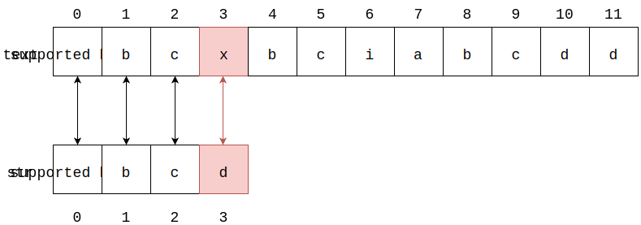
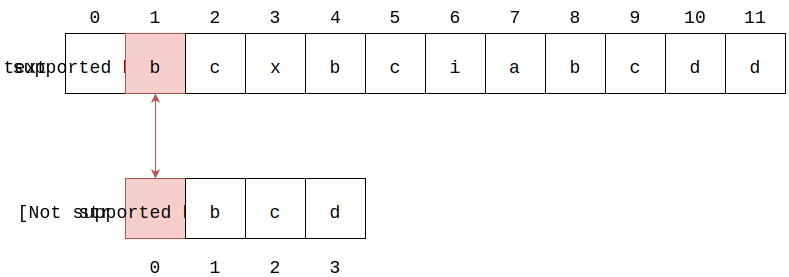
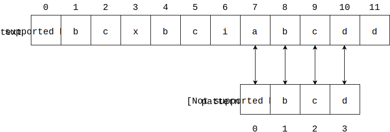

# Simple Match - 简单匹配

--------

#### 问题

在文本$$ text $$中查找字符串$$ pattern $$出现的所有位置（$$ text $$长度为$$ n $$，$$ pattern $$长度为$$ m $$，$$ n, m $$都是正整数且$$ n \gt m $$）。

#### 解法

对于$$ text[0 \dots n] $$，从$$ i = 0, j = 0 $$开始，依次比较$$ text[i+j] = pattern[j] $$。若相等则$$ j $$向后移动一个位置再继续比较，直到$$ j \ge m $$，即$$ text[i \dots i+m-1] = pattern[0 \dots m-1] $$，说明$$ pattern $$在$$ text $$的$$ i $$下标出现；否则$$ i = i+1, j = 0 $$重新开始新一轮匹配。

下面演示一个匹配的过程：

$$ (1) $$ 从$$ text $$第$$ 0 $$个字符开始匹配，有$$ text[0 \dots 2] = pattern[0 \dots 2]，text[3] \ne pattern[3] $$，继续匹配下一个字符；

$$ (2) $$ 从$$ text $$第$$ 1 $$个字符开始匹配，有$$ text[1] \ne pattern[0] $$，继续匹配下一个字符；

$$
\cdots
$$

$$ (3) $$ 从$$ text $$第$$ 7 $$个字符开始匹配，$$ text[7 \dots 10] = pattern[0 \dots 3] $$，匹配成功，算法结束；

显然，对于$$ text $$中的每个位置$$ i $$，都需要进行一次匹配，而每次匹配的平均时间复杂度为$$ pattern $$的长度$$ m $$。该算法的时间复杂度为$$ O(m \times n) $$。

--------

#### 源码

[import, lang:"c_cpp", name:"SimpleMatch.h"](https://github.com/linrongbin16/Way-to-Algorithm/blob/master/src/TextMatch/SimpleMatch.h)

[import, lang:"c_cpp", name:"SimpleMatch.cpp"](https://github.com/linrongbin16/Way-to-Algorithm/blob/master/src/TextMatch/SimpleMatch.cpp)

#### 测试

[import, lang:"c_cpp", name:"SimpleMatchTest.cpp"](https://github.com/linrongbin16/Way-to-Algorithm/blob/master/src/TextMatch/SimpleMatchTest.cpp)
